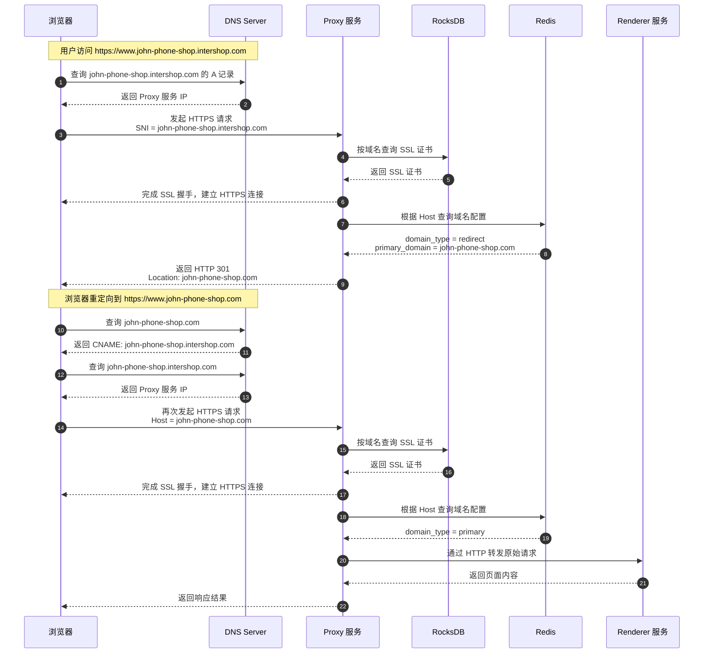
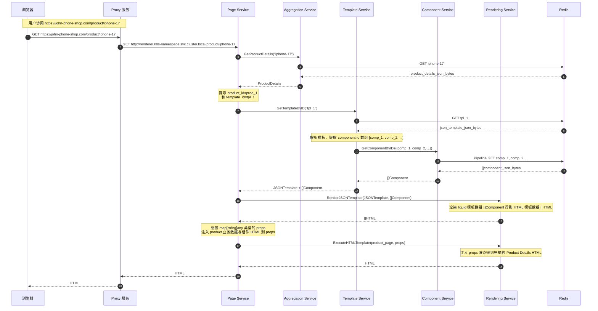
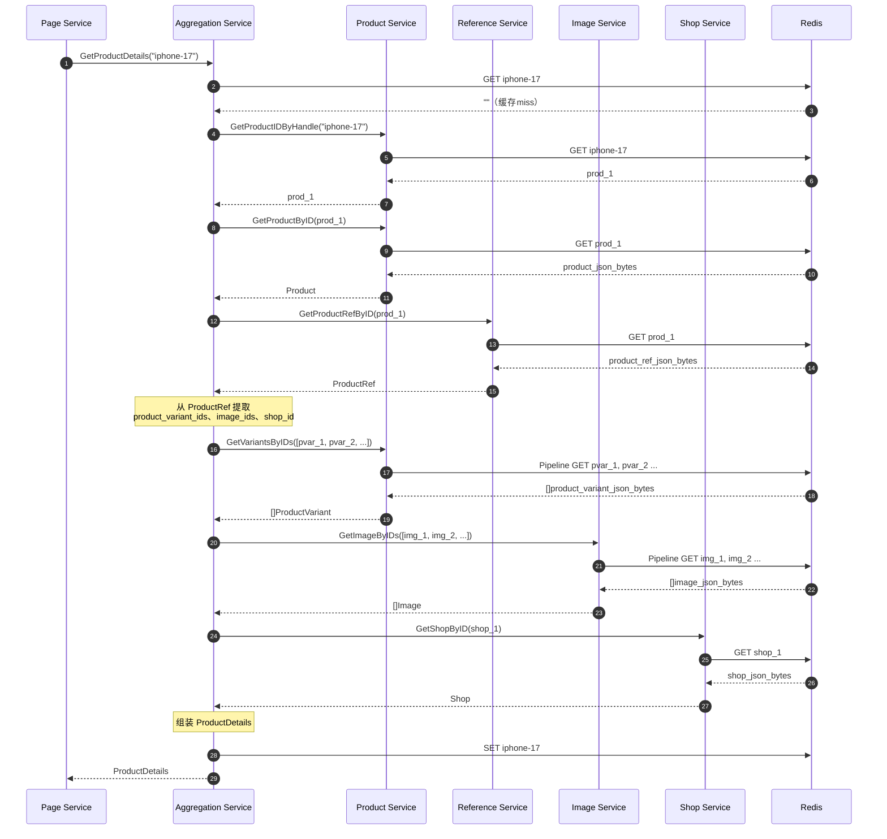
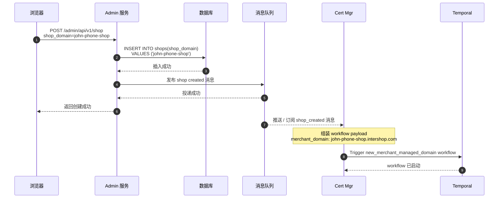
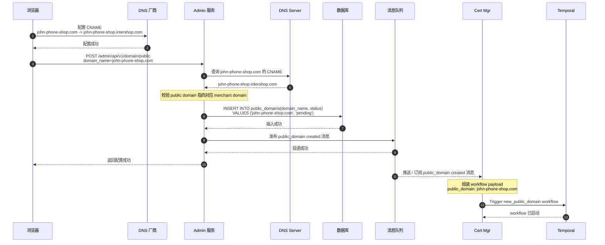

# cv-demo

## 1. 简历内容与 demo 位置的索引

### 项目经历

#### 店铺页面（Storefront）

2025.04 - 2025.09  
技术栈：Golang + gin + GORM + CockroachDB + Redis + Badger + Google Pub/Sub

项目介绍：Storefront 是一个 CMS 系统，具体可分为管理端（Page Admin）和用户端（Renderer）。管理端允许商家通过页面编辑器（editor）构建页面模板；用户端负责将页面模板渲染生成 HTML 供访问。

工作内容：

1. 实现页面构建的全流程：  
   ① [实现组件、页面模板等原始 JSON 数据的预处理](/biz/design/preprocessor/)，包括结构化、有效性和安全性校验，并通过延迟解析、责任链模式优化处理逻辑。  
   ② [实现服务端渲染，包括从 liquid 页面模板到 HTML 的渲染流程，以及业务数据的初步注入](/biz/design/renderer/rendering/)。
2. 实现 Page Admin：  
   ① [实现 editor](/biz/design/renderer/editor/)，使用 Redis 实现页面草稿的实时预览，并基于乐观锁思想避免多人保存草稿时发生并发覆盖。  
   ② 根据页面草稿写多读少、无模式的特点选择 Badger 作为持久化存储，并订阅 Redis KeySpace 通知，实现 Write Back 形式的草稿缓存落盘策略。
3. [为 Renderer 构建缓存层](/biz/design/renderer/caching/)：  
   ① 在数据模型多且种类杂的背景下，设计聚合模型层与基本模型层的两层缓存结构，定义各层依赖关系和职责，实现关注点分离。  
   ② 根据不同模型的读写频率采用不同的数据同步策略；当 Cache Aside 策略的缓存过期时，结合 SingleFlight 实现缓存回写。  
   ③ 通过空值占位符的方式避免缓存穿透。

#### 商家端管理（Admin）

2025.09 - 2026.02  
技术栈：Golang + gin + GORM + CockroachDB + Google Pub/Sub

项目介绍：Admin 负责为商家提供各种资源的管理功能，包括商品管理、支付管理等业务逻辑。

工作内容：

1. 商品管理：  
   ① 定义“商品”“商品变体”“商品目录”等模型之间的关系，实现业务逻辑。  
   ② [使用 `OnConflict` 子句重构原 `REPLACE INTO` 实现的 Upsert 逻辑，优化批量创建和更新业务](/biz/examples/batch-upsert/)。
2. [支付管理](/biz/examples/payment/)：  
   ① 重构支付管理业务，将编排关系从“支付方式”模型中独立出来，抽象成新的“支付规则”模型来描述这些关系，实现数据模型与计算模型解耦。  
   ② [通过部分唯一索引约束特定支付规则的唯一性](/pkg/model/object/payment_rule.go)。
3. 图片管理：  
   ① 重构图片模型，使用多个 many-to-many 关系实现“图片能被多个实体绑定”的逻辑。  
   ② [引入 GCS / S3 作为对象存储，重构原中转式上传逻辑，改为客户端直传，避免影响业务服务](/biz/design/image/storage/)。
4. 授权与登录：  
   ① [实现 OAuth 2.0，结合业务对 go-oauth2 库进行扩展，允许第三方 APP 授权访问店铺资源](/biz/design/oauth2/)。  
   ② [实现 TOTP 形式的 2FA 登录](/biz/examples/2fa/)。
5. [Bugfix](/bugfix/) 与优化：  
   ① 重构遗留的 N+1 数据库查询逻辑，优化为 $O(1)$ 时间复杂度查询。  
   ② [查阅 CockroachDB 对事务隔离性的实现方案，重新设计事务抛错方式，避免事务意外回滚](/biz/design/proj-structure/crdb-tx/)。  
   ③ [重构项目结构，定义各层职责，解决代码耦合和复用率低的问题](/biz/design/proj-structure/layer/)。

#### 证书管理（Certificates Manager）

2024.12 - 2025.03  
技术栈：Rust + axum + Temporal + SeaORM + CockroachDB

项目介绍：Certificates Manager 负责各类域名 SSL 证书的申请、存储等管理工作。

工作内容：

1. [引入 Rust Temporal SDK 对原项目进行重构](/biz/design/cert-mgr/)：  
   ① 借助 Temporal Workflow、Worker 的能力实现业务程序的水平扩展、故障转移和断点重试。  
   ② 在需要频繁调用外部 API 的业务场景下，下沉失败重试逻辑至 SDK，实现业务代码和异常处理逻辑解耦。
2. 持久化各类域名的布隆过滤器，作为网关服务（Proxy）布隆过滤器缓存的数据源。
3. 搭建环境（如 DNS、ACME 等）并编写集成测试，跑通申请 SSL 证书和建立 HTTPS 连接的业务流程。

#### 其他项目

1. [Commitlog](/pkg/commitlog/)
   - 移植 Rust 开源项目 [zowens/commitlog](https://github.com/zowens/commitlog)，基于 B-Tree、mmap 实现连续的、基于磁盘的二进制追加日志。
   - [把 commitlog 用作 WAL，配合边车模式实现高频写入场景（埋点上报）的异步写入缓冲](/biz/design/event-tracking/)。
2. 搭建 CI/CD Pipeline
   - 基于 k3S、GitLab Runner、ArgoCD 搭建符合 GitOps 理念的 CI/CD 流水线。

## 2. 关键业务链路介绍

### 2.1. 域名解析与建立 HTTPS 连接

### 2.2. Renderer 渲染页面

以渲染商品详情页为例（省略缓存失效回查 CockroachDB 的过程）

#### 2.2.1. 查询数据，渲染模板（假设 AggregationService 能直接从 Redis 查询得到完整的业务数据）

#### 2.2.2. AggregationService 组装业务数据（假设 Redis 缓存没有失效，省略回查 CockroachDB 的过程）

### 2.3. 域名管理

#### 2.3.1. 创建 store 时自动创建 MerchantDomain

#### 2.3.2. 商家配置 PublicDomain

### 2.4. Cache Aside
