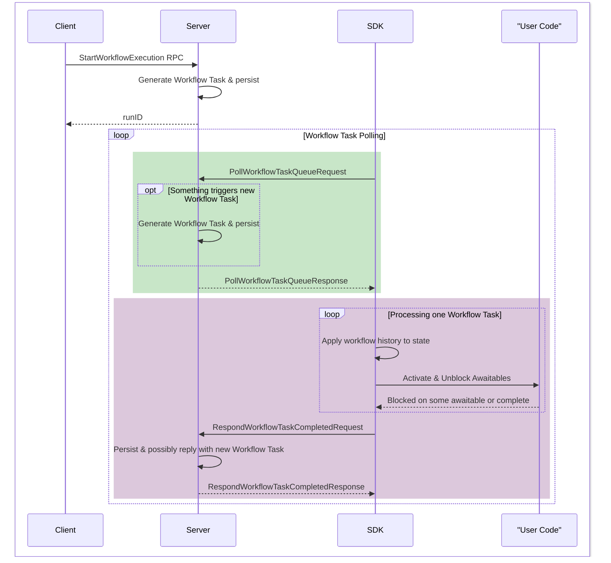
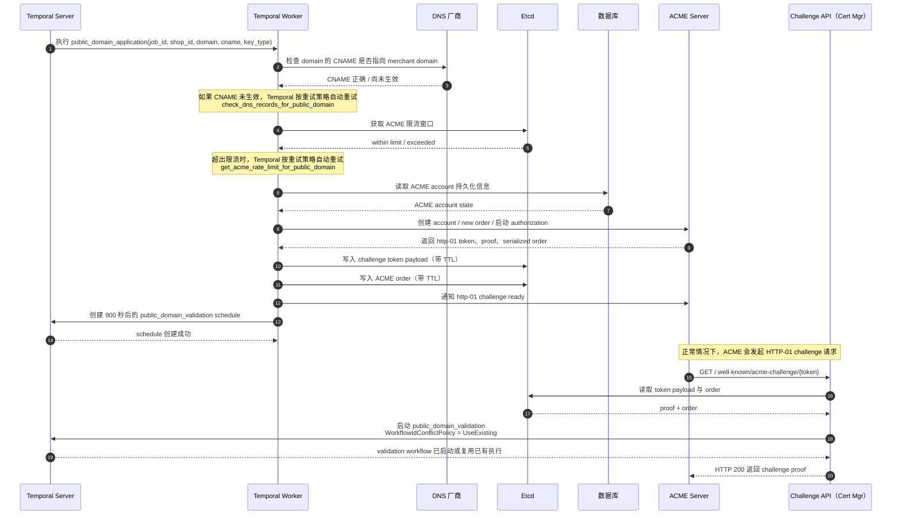
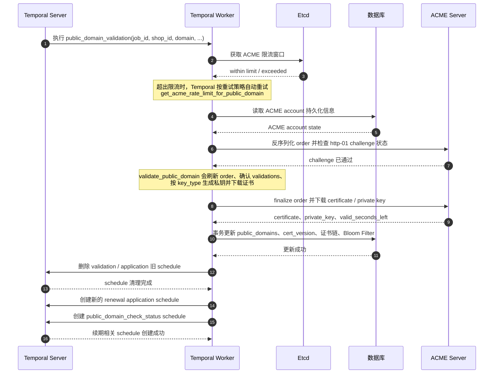
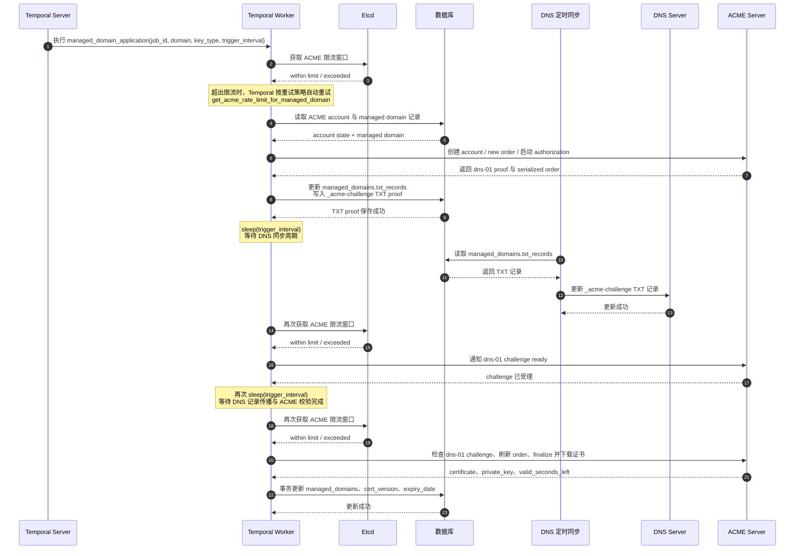
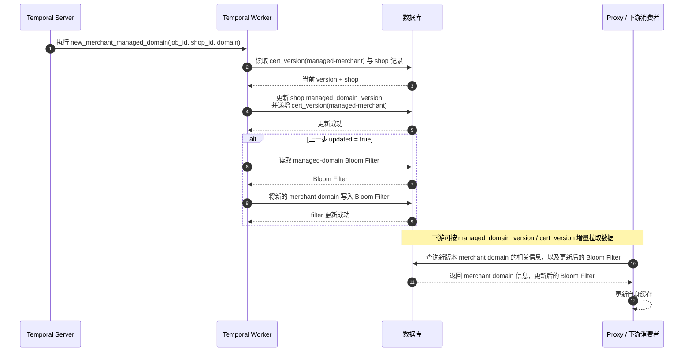

# Certificates Manager

## 1. Temporal 能力介绍

[Temporal](https://temporal.io/) 是一个面向分布式业务流程的 `Durable Execution` 平台，可以理解为“把长链路业务流程写成代码，并由平台负责可靠执行”。在传统实现里，一个证书申请流程往往会跨越多个步骤，例如查询数据库、调用外部 DNS API、等待证书签发结果、更新状态、失败后重试等。只要中间某一步依赖外部系统，就不可避免会遇到超时、进程重启、网络抖动、服务实例迁移等问题。Temporal 的核心目标，就是把这些“流程编排、状态保存、失败恢复、超时与重试”从业务代码里剥离出来，交给平台统一处理。

Temporal 的核心组成可以概括为三部分：

- `Workflow`：用代码描述完整业务流程，本质上就是业务状态机和编排逻辑。
- `Activity`：Workflow 中真正执行副作用的步骤，例如查询 DNS、写数据库、调用 CA 服务、发送通知等。
- `Worker`：运行 Workflow / Activity 代码的工作进程；真正执行用户代码的是 Worker，而不是 Temporal Server。

在架构上，Temporal 由业务应用和 `Temporal Service` 共同组成。业务代码通过 SDK 与 Temporal Service 通信，Temporal Service 持久化保存每个 Workflow 的事件历史（Event History），Worker 再基于这些历史记录执行或重放 Workflow。这样即使 Worker 宕机、服务重启，Workflow 也可以从上一次成功的位置继续推进，而不是从头开始，也不会因为进程退出而丢失上下文。

Temporal 提供的核心能力包括：

- 持久化执行：长时间运行的流程可以持续几分钟、几天，甚至更久，中间发生重启或故障也不会丢失进度。
- 自动失败恢复：Activity 失败后可以按策略自动重试，适合处理网络抖动、临时性外部依赖故障等问题。
- 超时与故障检测：可以为不同步骤配置超时，避免任务无界阻塞。
- 事件历史与 Replay：平台持久化每一步事件，Worker 可以通过 Replay 恢复 Workflow 状态。
- 可观测性：可以通过 UI / CLI 查看 Workflow 当前状态、执行历史、失败位置和重试情况。
- 长流程版本演进：支持对长生命周期 Workflow 做版本控制，避免业务代码升级后破坏仍在运行中的旧流程。
- 定时与消息驱动能力：支持定时启动 Workflow，也支持在运行中接收消息、取消、终止或补偿。

Temporal 主要解决的是传统分布式业务流程里的几个典型问题：

- 流程状态难维护：如果不用 Temporal，业务代码通常需要自己维护“当前进行到哪一步”的状态表。
- 失败恢复复杂：进程重启、Pod 漂移、服务崩溃后，需要自己写恢复逻辑继续执行未完成任务。
- 重试逻辑分散：每个外部调用都要单独实现重试、退避、超时控制，代码容易重复且不一致。
- 流程跨服务后难追踪：一条业务链路涉及多个异步步骤时，很难统一观察当前状态和失败原因。
- 长流程容易和业务代码耦合：证书申请、域名生效、DNS 校验这类流程天然是状态驱动、异步推进的，如果全部手写，代码会迅速膨胀成“数据库状态轮询 + 定时任务 + 消息补偿”的组合。

对当前 `Certificates Manager` 场景来说，Temporal 很适合用来承载“申请域名证书”这类长链路异步流程。因为证书申请并不是一次同步请求就能完成的操作，它会包含多个外部依赖步骤，例如写库、调用 DNS 服务、等待 DNS 记录生效、向 CA 发起申请、轮询签发结果、落库更新状态等。把这些步骤封装成 Workflow 与 Activity 后，业务代码可以更聚焦在“证书流程本身”，而不需要把大量精力放在故障恢复、补偿重试和状态续跑上。

## 2. 业务介绍

### 2.1. 申请 Public Domain 的 SSL 证书

`public_domain_application` 是 Public Domain 证书申请流程的第一阶段 Workflow。它的输入包括 `job_id`、`shop_id`、`domain`、`cname` 和 `key_type`，负责把“商家已经在 DNS 厂商侧完成 CNAME 配置”这件事，推进到“ACME challenge 已经准备好，后续 validation 可以被触发”的状态。

从代码上看，这个 Workflow 主要串起了 4 个 Activity：

1. `check_dns_records_for_public_domain`：先检查 `domain` 的 CNAME 是否已经正确指向 `merchant domain`。如果 DNS 还没有生效，Temporal 会按照重试策略自动重试这个 Activity，而不是让业务代码自己写轮询。
2. `get_acme_rate_limit_for_public_domain`：在真正调用 ACME 之前，先通过 Etcd 上的限流窗口检查当前 ACME API 配额。
3. `initiate_new_acme_order_for_public_domain`：创建 ACME Account / Order，启动 authorization，从 ACME Server 取出 `http-01` challenge 的 `token` 和 `proof`，再把 challenge token 和序列化后的 ACME order 写入 Etcd，并设置 TTL，供后续 challenge API handler 与 validation Workflow 使用。
4. `schedule_validation_for_public_domain`：创建一个 900 秒后的 Temporal Schedule，作为兜底机制去启动 `public_domain_validation` Workflow，避免因为外部回调丢失导致流程卡住。

这段流程里，真正的证书校验与入库并不是在 `public_domain_application` 内完成的，而是交给后续的 `public_domain_validation` Workflow。当前实现里有两条触发路径：

- 正常路径：ACME Server 访问 `/.well-known/acme-challenge/{token}`，challenge handler 从 Etcd 读出 token 和 order，并立即启动 `public_domain_validation`。
- 兜底路径：如果 challenge 回调没有及时触发，Temporal Schedule 会在 900 秒后自动启动同一个 validation Workflow。

因此，`public_domain_application` 的核心职责不是“签发证书”，而是把 DNS 校验、ACME 下单、challenge 准备、状态暂存、后续 validation 调度这几件事可靠地编排起来。

`public_domain_validation` 是 Public Domain 证书申请流程的第二阶段 Workflow，负责把“challenge 已经准备完成”的状态推进到“证书已经签发并落库”的状态。它的输入除了 `job_id`、`shop_id`、`domain`、`cname`、`key_type` 之外，还包括前一阶段准备好的 `acme_account_id` 和序列化后的 `order`。

这个 Workflow 的执行步骤也比较清晰：

1. 再次执行 `get_acme_rate_limit_for_public_domain`，确保真正向 ACME 查询校验结果、拉取证书前，仍然处在允许的调用窗口内。
2. 执行 `validate_public_domain`：反序列化前一阶段保存在 Etcd 中的 ACME order，检查 `http-01` challenge 是否已经通过，刷新 order 状态，确认 validations，按 `key_type` 生成私钥，最终向 ACME Server 下载证书和私钥，并计算证书剩余有效期。
3. 执行 `save_certificate_to_db_for_public_domain`：开启数据库事务，写入公共域名证书，再更新数据库中的 `public_domains`、`cert_version`、证书链和 Bloom Filter，把 Public Domain 的状态更新为 `connected`。
4. 执行 `clean_up_schedule_for_public_domain`：删除当前 job 对应的 validation schedule，以及相关的 application schedule，避免证书已经签发后旧 schedule 继续触发。
5. 执行 `set_renewal_for_public_domain`：根据证书剩余有效期，为下一次续签创建新的 `public_domain_application` schedule，并额外创建一个 `public_domain_check_status` schedule，用来在证书实际到期时校验数据库状态。

如果说 `public_domain_application` 解决的是“如何把证书申请准备好”，那么 `public_domain_validation` 解决的就是“如何在 challenge 生效后，可靠地完成签发、持久化和续期编排”。两者串在一起，才构成完整的 Public Domain 证书生命周期。

### 2.2. 申请 Managed Domain 的 SSL 证书

`managed_domain_application` 负责 Managed Domain 证书申请的完整主流程。和 Public Domain 不同，Managed Domain 使用的是 `dns-01` challenge，而不是 `http-01` challenge，因此它不依赖 challenge API 回调，也不拆分成 `application` 和 `validation` 两个独立 Workflow；从下单、准备 DNS proof、触发 challenge 到最终校验证书并落库，都是在同一个 Workflow 内完成的。

这个 Workflow 的输入包括 `job_id`、`domain`、`key_type` 和 `trigger_interval`。其中 `trigger_interval` 很关键，它需要和 DNS 记录同步到权威 DNS 的周期对齐，所以代码里会在两个关键阶段之间主动 `sleep`：第一次等待 `_acme-challenge` TXT 记录从数据库同步到 DNS，第二次等待 ACME 侧完成 DNS 校验。

从代码上看，这个 Workflow 主要包含 5 个阶段：

1. `get_acme_rate_limit_for_managed_domain`：在调用 ACME 之前先检查当前配额，避免失败重试把流量直接打到 CA 服务。
2. `initiate_new_acme_order_for_managed_domain`：创建 ACME Account 和新的 ACME Order，请求的是 `*.domain` 的通配符证书；随后启动 authorization，提取 `dns-01` challenge 的 `dns_proof`，并把 `_acme-challenge` 对应的 TXT 记录写入数据库中的 `managed_domains.txt_records`。
3. `sleep(trigger_interval)` 后执行 `trigger_dns_01_challange_for_managed_domain`：等待外部 DNS 同步流程把数据库中的 TXT 记录更新到 DNS Server / DNS 厂商，再显式通知 ACME `dns-01` challenge 已准备完成。
4. 再次 `sleep(trigger_interval)` 后执行 `validate_managed_domain`：重新拉取并反序列化 ACME order，检查 `dns-01` challenge 是否通过，刷新 order 状态，确认 validations，按 `key_type` 生成私钥，最终下载证书和私钥，并计算证书剩余有效期。
5. `save_certificate_to_db_for_managed_domain`：开启事务，写入 `managed_domains` 的证书、私钥、状态、版本号、续签时间和过期时间，同时更新 `cert_version`。

这条链路的关键特点是：Managed Domain 的 challenge 不是由外部 ACME Server 直接回调 Cert Mgr，而是先把 DNS proof 写入数据库，等待内部 DNS 更新链路把 TXT 记录同步出去，再由 Workflow 主动继续推进后续 challenge ready 与 validation 步骤。因此它更像一个“按固定时间窗口推进”的串行流程，而不是 Public Domain 那种“外部回调 + 兜底 schedule”双触发模型。

### 2.3. 为新 Merchant Domain 更新 Managed Domain Cert Version

`new_merchant_managed_domain` 这个 Workflow 处理的不是“证书申请”，而是“当店铺创建了新的 merchant domain 之后，如何把这个新域名发布到系统里，并推动下游感知到 managed domain 版本发生变化”。

这里的 `merchant domain` 本质上是由 `shop_domain + managed_domain` 组装出来的域名，例如 `john-phone-shop.intershop.com`。它本身并不单独申请证书，而是直接受顶层 `managed domain` 的泛域名证书保护。因此，这个 Workflow 的核心职责不是和 ACME 交互，而是更新数据库中的版本信息与过滤器，让 Proxy 或其他依赖方能够识别“有新的 merchant domain 已经加入 managed domain 覆盖范围”。

从代码上看，这个 Workflow 只有两个 Activity，但职责划分很明确：

1. `add_new_merchant_managed_domain_to_db`：读取 `cert_version(managed-merchant)` 和对应的 `shop` 记录，把 `shop.managed_domain_version` 与全局 `cert_version` 一起递增并保存。这里的含义是：店铺维度的 managed domain 信息发生了新版本变化，下游可以按 version 增量拉取。增量拉取是指下游消费者（Proxy 服务）自身维护当前持有的最高证书版本 `cert_version`，然后定时扫描数据库，查询并更新自身保存的最高版本 `cert_version`，根据两次版本之间的差筛选出新增的 Merchant Domain，然后从数据库找到这些新增 Merchant Domain 的 Shop 等相关信息保存到 Proxy 服务中。
2. `update_merchant_managed_domain_filter_in_db`：如果上一步成功更新了版本，就继续读取 `managed-domain` 对应的 Bloom Filter，把新的 merchant domain 写入过滤器并持久化。这样后续在高频查询场景下，可以先通过 Bloom Filter 快速判断某个域名是否可能属于 managed domain 范围。

这条流程的关键点在于：它解决的是“新 merchant domain 的发布与可见性”问题，而不是“证书签发”问题。因为 merchant domain 实际上复用了 managed domain 的泛域名证书，所以证书层面并不需要重新走一遍 ACME 申请；真正需要更新的是：

- 店铺数据库记录上的 `managed_domain_version` 字段
- 全局 `managed-merchant` cert version
- 用于快速判定域名是否存在的 Bloom Filter

这样设计之后，下游服务只需要比较版本号或查询过滤器，就能知道是否需要重新加载 merchant domain 数据，而不需要每次都全量扫描数据库。

