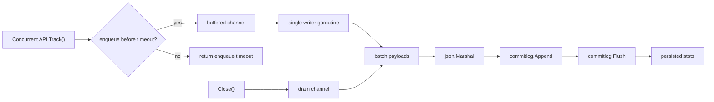

# Event Tracking Benchmark

这个目录补的是一条完整写入链路的 benchmark，而不是只测 `commitlog.Append/Flush`。

## 覆盖范围

链路如下：

1. API 接收 `TrackingPayload`
2. API 层用 `context.WithTimeout` 控制入队超时
3. payload 通过 buffered channel 异步传给单写协程
4. 单写协程批量 JSON 编码并写入 `commitlog`
5. 每批调用 `Append` 和 `Flush`，确保落盘
6. benchmark 结束时执行 `Close`，把队列剩余数据 drain 完再统计结果



## 设计约束

- `commitlog` 不是线程安全的，所以这里只允许一个 writer goroutine 直接调用它
- API 并发只负责入队，不直接写盘
- `Close()` 开始后，新的 `Track()` 会被拒绝，避免数据写进已经无人消费的 channel

## 运行方式

测试关键行为：

```bash
GOCACHE=/tmp/cv-demo-go-build go test ./biz/design/event-tracking -run TestTrackingAPI
```

运行 benchmark：

```bash
GOCACHE=/tmp/cv-demo-go-build go test ./biz/design/event-tracking -run '^$' -bench BenchmarkTrackingAPI -benchmem
```

只扫描 batch flush 参数：

```bash
GOCACHE=/tmp/cv-demo-go-build go test ./biz/design/event-tracking -run '^$' -bench BenchmarkTrackingAPI_FlushBatchSweep -benchmem -benchtime=3s -count=3
```

拉长时长拿稳定结果：

```bash
GOCACHE=/tmp/cv-demo-go-build go test ./biz/design/event-tracking -run '^$' -bench BenchmarkTrackingAPI -benchmem -benchtime=5s -count=3
```

## 指标解读

- `ns/op`: 每次 API 调用的平均耗时，包含异步入队和最终 drain 成本
- `B/op`, `allocs/op`: 每次调用在 Go 堆上的分配成本
- `MB/s`: 按 payload 字节数折算的吞吐
- `accepted/s`: API 成功入队的速率
- `persisted/s`: 实际刷入 commitlog 的速率
- `timeout/s`, `timeout-%`: 因入队阻塞超过 API 超时阈值而被丢弃的速率和比例

`5events_flush100_tight_timeout` 这个场景是故意把队列和超时阈值收紧，用来观察背压触发后的丢弃比例，不是追求最高吞吐。

## Batch Flush 参数结果

下面这组结果来自 2026-03-19 的实测，机器是 Apple M2，`darwin/arm64`。

固定条件：

- payload: 每次 `Track()` 写入 1 个 `TrackingPayload`，其中包含 5 个 `TrackingEvent`
- queue capacity: `8192`
- enqueue timeout: `200ms`
- flush interval: `2ms`
- parallelism: `4`
- benchmark command: `go test ./biz/design/event-tracking -run '^$' -bench BenchmarkTrackingAPI_FlushBatchSweep -benchmem -benchtime=3s -count=3`
- 表中数值为 3 次运行的均值

| flushBatch | avg ns/op | avg accepted/s | avg MiB/s | avg B/op | 相比 flush=1 |
| --- | ---: | ---: | ---: | ---: | --- |
| 1 | 4,638,872 | 216 | 0.53 | 14,970 | baseline |
| 5 | 878,365 | 1,145 | 2.80 | 14,547 | 吞吐 +430.1%，时延下降 81.1% |
| 10 | 488,844 | 2,050 | 5.01 | 14,548 | 吞吐 +849.1%，时延下降 89.5% |
| 20 | 304,414 | 3,287 | 8.03 | 14,691 | 吞吐 +1421.8%，时延下降 93.4% |
| 50 | 166,575 | 6,014 | 14.69 | 14,532 | 吞吐 +2684.3%，时延下降 96.4% |
| 100 | 106,908 | 9,359 | 22.87 | 14,460 | 吞吐 +4232.9%，时延下降 97.7% |
| 200 | 103,364 | 9,722 | 23.75 | 17,402 | 吞吐 +4400.9%，时延下降 97.8% |

## 结果解读

- `flushBatch=1` 本质上接近“每条 payload 都单独刷盘”，吞吐最低，这个结果符合预期。
- `flushBatch` 从 `1` 提升到 `20` 时，收益非常陡，说明当前瓶颈主要是 `Append + Flush` 的固定成本，而不是 JSON 编码。
- `flushBatch` 到 `50` 以后仍然有提升，但已经开始进入边际收益递减区间。
- `flushBatch=100` 是这轮测试里最均衡的点。相比 `flush=1`，吞吐提升约 `42.3x`，同时 `B/op` 没有恶化。
- `flushBatch=200` 比 `100` 只多了约 `3.9%` 的 `accepted/s` 和 `3.8%` 的 `MiB/s`，但 `B/op` 增加了约 `20.3%`，而且三次结果波动也更大。

## 建议

- 如果目标是保守而稳定的吞吐提升，`flushBatch=100` 更合适。
- 如果只追求这台机器上的极限吞吐，`flushBatch=200` 还能再挤出一点性能，但收益已经不大。
- 如果后续接入真实网络 API 或更重的 payload，建议重新跑同一组 sweep，不要直接把这里的最优值当成通用默认值。
