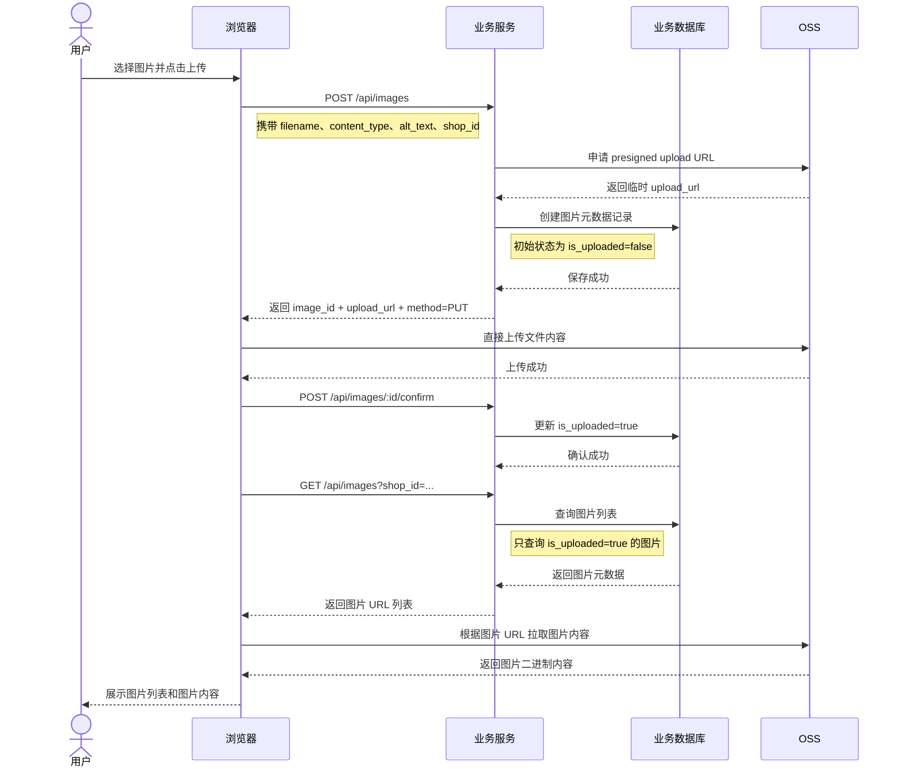

# OSS 客户端直传图片

## 1. 业务介绍

这个 demo 演示的是一种常见的图片上传方案：业务服务先给前端签发一个可临时使用的上传地址，前端再直接把文件上传到 OSS，上传完成后，业务系统通过数据库中的图片记录和对象存储中的文件地址来展示图片列表。

从代码实现上看，这个示例包含几步关键动作：

- 浏览器访问 `/`，加载一个简单的上传页面。
- 前端点击上传时，先调用业务接口 `POST /api/images`，提交 `filename`、`content_type` 和 `alt_text`。
- 业务服务根据当前 `shop_id` 生成图片 `file_key`，向存储服务申请一个带过期时间的 presigned upload URL。
- 业务服务在自己的数据库里先创建一条图片记录，保存 `image_id`、`shop_id`、`bucket`、`file_key`、`content_type` 等元数据，并将它标记为“未确认上传完成”。
- 前端拿到 `image_id` 和 `upload_url` 后，使用 `PUT` 请求直接把文件上传到 OSS，而不是把文件内容先传给业务服务。
- OSS 上传成功后，前端再调用 `POST /api/images/:id/confirm`，通知业务服务将这条图片记录标记为“已上传完成”。
- 最后前端调用 `GET /api/images?shop_id=...` 查询图片列表。业务服务只返回已经确认上传成功的图片记录，并拼出可访问的图片 URL 返回给前端。

可以用下面这张时序图理解整个直传流程：



这个流程的重点是：文件二进制内容不经过业务服务，业务服务只负责鉴权、生成对象 key、申请上传凭证、保存元数据、确认上传完成以及查询展示结果。

当前实现已经补上了“上传完成确认”这一步，因此列表接口不会直接暴露那些尚未确认上传成功的记录。并且在确认上传时，后端会先校验目标对象是否真的已经存在于 OSS 中，只有校验通过后才会把数据库记录更新为 `is_uploaded=true`。不过这仍然不是一个完全闭环的强一致方案，在真实业务里如果希望进一步降低脏数据风险，通常还会继续补下面这些机制：

- 为长时间未确认的预上传记录做定时清理。
- 在前端上传失败时主动调用取消接口，或在后端做异步补偿。

## 2. 客户端直传方案 vs 业务服务中转上传

客户端直传和服务端中转上传的核心区别，在于文件内容到底经过谁。

| 方案             | 上传链路                                         | 优点                                                              | 缺点                                                                           | 适用场景                                         |
| ---------------- | ------------------------------------------------ | ----------------------------------------------------------------- | ------------------------------------------------------------------------------ | ------------------------------------------------ |
| 客户端直传 OSS   | 浏览器 -> 业务服务申请上传凭证 -> 浏览器直传 OSS | 业务服务带宽压力小；上传大文件更高效；可以直接利用 OSS 的上传能力 | 流程更复杂；前端需要处理两段请求；需要处理凭证过期、上传失败、脏数据清理等问题 | 图片、视频、附件等大文件上传；高并发上传场景     |
| 业务服务中转上传 | 浏览器 -> 业务服务 -> 业务服务上传 OSS           | 实现简单；业务服务更容易统一做鉴权、内容校验、压缩转码、审计      | 文件流量全部经过业务服务；带宽和机器压力更大；大文件上传成本高                 | 小文件上传；需要强校验、强管控、强同步处理的场景 |

如果从这个 demo 的视角来看，两种方案可以这样理解：

- 直传方案里，`POST /api/images` 并不接收文件二进制，只负责创建预上传记录并返回一个预签名上传地址；上传成功后再通过 `POST /api/images/:id/confirm` 完成状态确认。
- 中转方案里，`POST /api/images` 往往会直接接收 multipart/form-data 文件，再由服务端调用存储 SDK 执行上传。

因此，客户端直传更偏向“业务服务负责控制面，OSS 负责数据面”；而服务端中转上传更偏向“业务服务同时负责控制面和数据面”。

在图片上传场景里，如果重点是降低业务服务的网络和 CPU 压力，通常优先考虑客户端直传；如果重点是上传时必须做严格的内容审核、实时转码、统一加密或复杂的业务校验，则更适合由业务服务中转上传。

## 3. 运行 demo

### 3.1. 运行步骤

这个 demo 依赖 mock integration 服务提供对象存储能力，因此运行顺序是：

1. 先启动 integration，提供本地 S3 / GCS mock 服务。
2. 再启动图片上传业务程序。

为了减少手动操作，仓库根目录已经把这两个动作封装进一个命令里了：

```bash
make image-storage-demo-start
```

这个命令会自动完成下面两件事：

- 启动 `go run ./integration`，提供本地 mock S3 和 mock GCS 服务。
- 启动 `go run ./biz/design/image/storage`，运行图片直传 demo。

启动成功后，默认可以访问：

- `http://localhost:2020`：图片直传 demo 页面
- `http://localhost:2020/healthz`：业务程序健康检查
- `http://localhost:4000`：mock S3 服务
- `http://localhost:4001`：mock GCS 服务

如果你想查看当前运行状态，可以在仓库根目录执行：

```bash
make image-storage-demo-status
```

如果你想停止这套 demo，可以执行：

```bash
make image-storage-demo-stop
```

日志会写到：

- `tmp/image-storage-demo/integration.log`
- `tmp/image-storage-demo/app.log`

当前默认配置使用 S3 风格的 mock 存储，因此直接访问 `http://localhost:2020` 选择图片上传即可。业务程序默认会把图片元数据写到 `tmp/image-storage-demo/image-storage.db`。

### 3.2. 运行截图


我们点击**查看原图**，可以看到 OSS 原图的 URL


