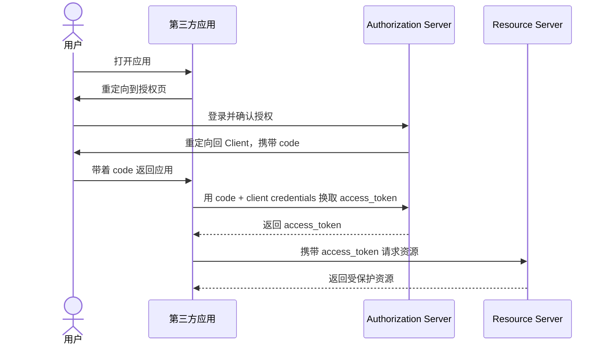
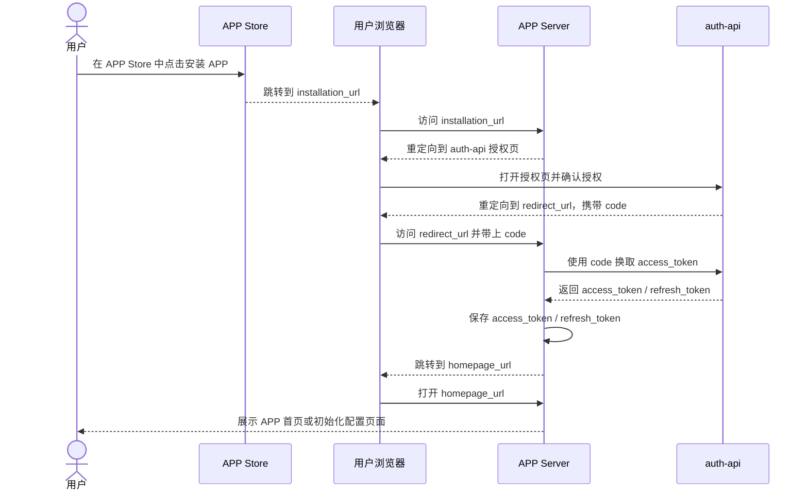
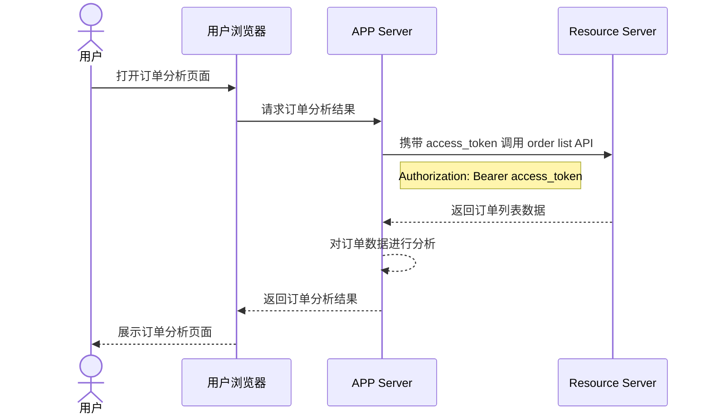
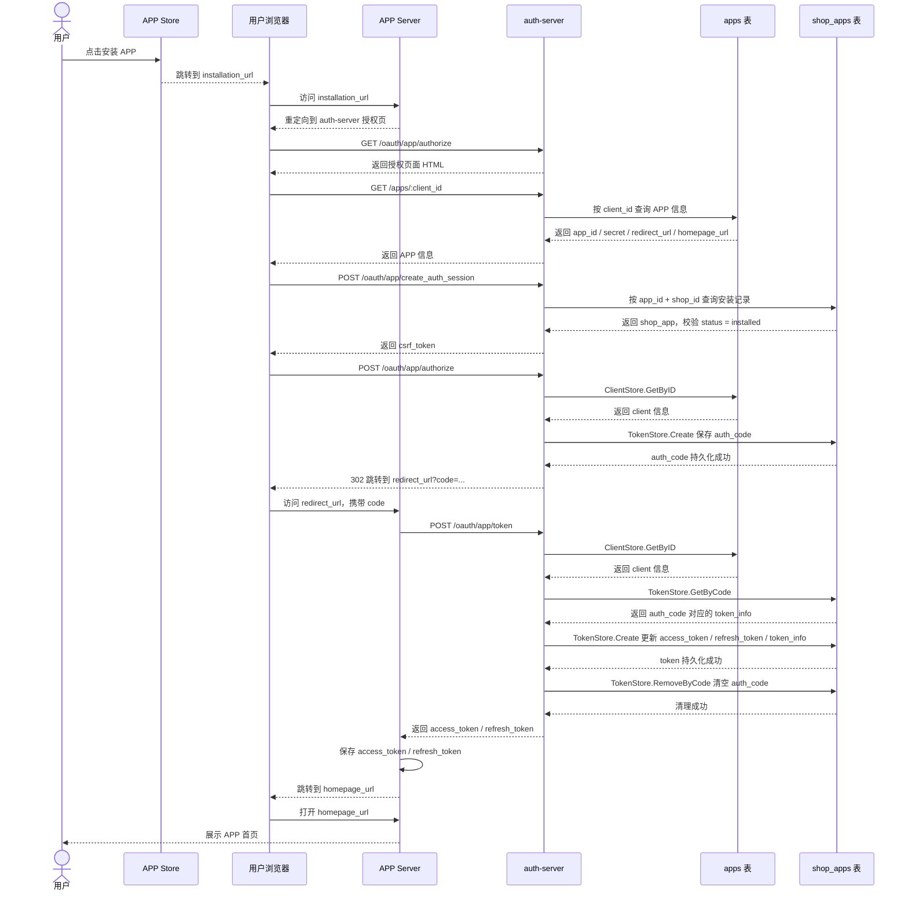

# OAuth 2.0 实现授权第三方 APP

## 1. 业务介绍

### 1.1. Shopify APP Store

我们以 Shopify 为例，在 Shopify 中，我们可以在 APP Store 中挑选一款 APP 来实现功能扩展


选择一款 APP，就会进入到它的授权页面


当我们点击安装后，shopify 会根据不同 APP 的配置跳转到相应的页面（可能是 shopify 站内 iframe 内嵌，可能是跳转到站外），让我们配置一些跟 APP 相关的内容


这一整个“安装 APP”的业务流程，实际上完成了一次 OAuth 2.0 授权。

### 1.2. OAuth 2.0

OAuth 2.0 是一套授权协议，它解决的核心问题是：用户如何在不把账号密码直接交给第三方应用的前提下，授权第三方应用访问自己在资源服务中的部分数据。

其中最常见、也是最适合服务端应用的方式，就是授权码模式（Authorization Code Grant）。它的基本角色包括：

- Resource Owner：用户
- Client：第三方应用，例如一个 Shopify APP
- Authorization Server：负责登录、授权、签发 token
- Resource Server：真正存放用户资源并校验 token 的服务

授权码模式的大致流程如下：

1. 用户进入第三方应用，应用将用户重定向到授权服务器。
2. 用户在授权服务器完成登录，并确认是否授权该应用访问指定资源。
3. 授权服务器在用户同意后，重定向回第三方应用，并附带一个临时的 authorization code。
4. 第三方应用在后端使用 authorization code、client_id、client_secret 向授权服务器换取 access_token。
5. 第三方应用再携带 access_token 去访问 resource server 中的用户数据。

可以用下面这张时序图来理解授权码模式：



这里的关键点在于：浏览器前端拿到的只是一个短期有效的 code，真正的 token 交换发生在服务端，因此比直接把 token 暴露在前端更安全。这也正是我们在 APP 安装与授权场景里采用这套模式的原因。

### 1.3. 业务流程

当我们需要结合 OAuth 2.0 实现**安装第三方 APP**业务时，首先需要面向 APP developer 开放 APP 注册功能，注册成功的 APP 将获取唯一的 app_id 和 app_secret。同时，我们需要 APP 开发者在注册时提供以下参数：

| 参数             | 作用                                                         |
| ---------------- | ------------------------------------------------------------ |
| installation_url | 当在 APP Store 点击该 APP 时，访问该 URL 开启 OAuth 2.0 流程 |
| redirect_url     | Authorization Server 生成 code 后的重定向地址                |
| homepage_url     | APP 安装成功后的重定向页面，用于完成自定义的 APP 功能配置    |

结合 OAuth 2.0 得到的 APP 安装流程可以概括为下面这张时序图：



例如，当我们安装了一个提供订单数据分析功能的 APP 时，APP Server 需要访问平台侧的 OrderList API，App Server 访问 Resource Server 的流程可以表示为：



## 2. 工作内容

### 2.1. 实现 go-oauth2 库的 store interface

**go-oauth2** 是一个 go 语言实现的 OAuth 2.0 库，它定义了两个 ClientStore 和 TokenStore 两个接口：

```go
package oauth2

import "context"

type (
	// ClientStore the client information storage interface
	ClientStore interface {
		// according to the ID for the client information
		GetByID(ctx context.Context, id string) (ClientInfo, error)
	}

	// TokenStore the token information storage interface
	TokenStore interface {
		// create and store the new token information
		Create(ctx context.Context, info TokenInfo) error

		// delete the authorization code
		RemoveByCode(ctx context.Context, code string) error

		// use the access token to delete the token information
		RemoveByAccess(ctx context.Context, access string) error

		// use the refresh token to delete the token information
		RemoveByRefresh(ctx context.Context, refresh string) error

		// use the authorization code for token information data
		GetByCode(ctx context.Context, code string) (TokenInfo, error)

		// use the access token for token information data
		GetByAccess(ctx context.Context, access string) (TokenInfo, error)

		// use the refresh token for token information data
		GetByRefresh(ctx context.Context, refresh string) (TokenInfo, error)
	}
)
```

在 go-oauth2 的默认实现中，ClientStore 使用内存 map 来存储，TokenStore 使用 boltdb 来存储。

```go
type ClientStore struct {
	sync.RWMutex
	data map[string]oauth2.ClientInfo
}

type TokenStore struct {
	db *buntdb.DB
}
```

因为我们的业务数据都是保存在数据库（CockroachDB）中的，所以我们要基于数据库存储重新实现这两个 interface。

在当前业务场景下，ClientStore 存储的是 APP 的相关信息，TokenStore 存储的是 Shop 和 APP 之间的联系和身份验证信息，所以我们会有如下数据库表：

```go
package object

type App struct {
	ID              string `gorm:"size:128;primarykey"`
	Name            string `gorm:"size:256;index;not null"`
	Secret          string `gorm:"size:64;not null"`
	InstallationURL string `gorm:"size:512"`
	RedirectURL     string `gorm:"size:512"`
	HomePageURL     string `gorm:"size:512"`

	CreatedAt time.Time
	UpdatedAt time.Time
	DeletedAt gorm.DeletedAt `gorm:"index"`
}

type ShopApp struct {
	AppID        string `gorm:"size:128;primarykey;foreignkey:ID"`
	ShopID       string `gorm:"size:128;primarykey;foreignkey:ID"`
	Status       string
	AuthCode     string
	AccessToken  string
	RefreshToken string
	TokenInfo    datatypes.JSON
	CreatedAt    time.Time
	UpdatedAt    time.Time
}
```

- `App`：保存 APP 的基础信息，例如 `app_id`、`app_secret`、`redirect_url`、`homepage_url`
- `ShopApp`：保存 Shop 与 APP 的安装关系，以及授权码、access token、refresh token 等 OAuth 信息

所以我们对 ClientStore 和 TokenStore 接口的实现，本质上是结合业务实现对上述两表的 CRUD 操作。

结合当前 auth-server 对 go-oauth2 的封装，完整的 APP 授权流程可以用下面这张时序图表示：



在这套实现里，授权码和 token 的生命周期并不是只存在于内存中，而是由 auth-server 通过 go-oauth2 的 `ClientStore` 和 `TokenStore` 读写数据库完成持久化。`ClientStore` 负责从 `apps` 表读取客户端信息，`TokenStore` 负责把授权码、access token、refresh token 和完整 token 信息写入 `shop_apps` 表。  
与此同时，APP Server 也会把换到的 `access_token` 和 `refresh_token` 保存到自己的数据库中，并与当前 shop 关联起来，方便后续直接访问受保护资源。

## 3. demo 运行

`cv-demo`仓库根目录的 `Makefile` 已经提供了一键启动脚本，可以同时拉起 `auth-server`、`app-server` 和 `resource-server`。

首先，在项目根目录执行：

```bash
make oauth2-demo-start
```

启动完成后，3 个服务的默认地址分别是：

- `auth-server`: `http://localhost:3360`
- `resource-server`: `http://localhost:3370`
- `app-server`: `http://localhost:9094`

启动日志和 PID 文件会写到 `tmp/oauth2-demo/` 目录下：

- `tmp/oauth2-demo/auth-server.log`
- `tmp/oauth2-demo/resource-server.log`
- `tmp/oauth2-demo/app-server.log`

然后按下面的顺序体验完整流程：

1. 打开 `http://localhost:3360/apps/page`，进入 `auth-server` 提供的 APP List 页面。
2. 如果当前还没有登录，先使用 demo 账号登录，账号`admin@shop.com`，密码`admin`。
3. 在 APP List 页面中选择一个 APP，点击安装。
4. 浏览器会根据该 APP 配置的 `installation_url` 跳转到 `app-server`，随后再跳转到 `auth-server` 的授权页面。
5. 在授权页面点击允许后，浏览器会跳回 `app-server`，由 `app-server` 使用 `code` 向 `auth-server` 换取 `access_token` 和 `refresh_token`。
6. `app-server` 保存 token 后，会继续跳转到订单页面，并通过 `resource-server` 的 Order List API 拉取订单数据，这样就能完整体验“选择 APP -> 安装 APP -> 在 APP 界面查询订单”的流程。

操作截图如下：
① 登录 auth-server（密码：admin）


② 进入 APP List 页面


③ 选择 Demo App，进入授权页面


④ 点击 Allow，完成授权


⑤ 点击按钮或者自动跳转到 App Server 的页面，App Server 使用自身保存的 access_token 访问 Resource Server 查询订单数据


注意，如果没有经过上述授权流程，直接访问 App Server 的订单列表页面`http://localhost:9094/orders`，会提示未授权


如果只想查看当前进程状态，可以执行：

```bash
make oauth2-demo-status
```

完成后可以一键停止 3 个服务：

```bash
make oauth2-demo-stop
```
