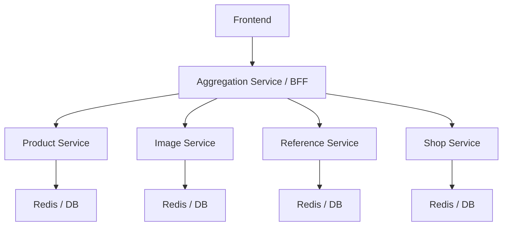
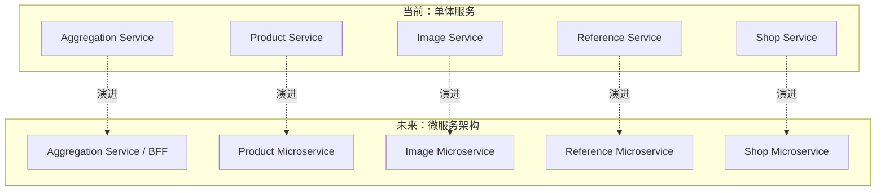

# Renderer 缓存设计


## 1. 缓存模型

存在三种缓存模型，分别为`基础缓存模型`、`关系缓存模型`、`聚合缓存模型`。

### 1.1. 基础缓存模型

基础缓存模型满足以下要求：
① 存在唯一一个与其对应的数据库模型
② 模型所需的所有数据均来自该数据库模型
③ 使用 Cache Aside 策略实现缓存更新

基础缓存模型的意义：`通过高速缓存加快访问数据库数据的速度`
基础缓存模型的设计理念：`数据库模型有什么，缓存模型就有什么`

以 Product 模型为例：

```go
// pkg/model/cache/product.go
package cache

// Product 缓存模型
type Product struct {
	ID          string                     `json:"id"`
	ShopID      string                     `json:"shop_id"`
	Title       string                     `json:"title"`
	Description string                     `json:"description"`
	Options     []*jsonmodel.ProductOption `json:"options"`
	UpdatedAt   time.Time                  `json:"updated_at"`
	CreatedAt   time.Time                  `json:"created_at"`
}

// ProductFromObject 构建 Product 缓存模型
func ProductFromObject(productObj *object.Product) *Product {
	return &Product{
		ID:          productObj.ID,
		ShopID:      productObj.ShopID,
		Title:       productObj.Title,
		Description: productObj.Description,
		Options:     productObj.Options,
		UpdatedAt:   productObj.UpdatedAt,
		CreatedAt:   productObj.CreatedAt,
	}
}
```

```go
// pkg/model/object/product.go
package object

// Product 数据库模型
type Product struct {
	ID          string `gorm:"size:128;primarykey"`
	ShopID      string `gorm:"size:128"`
	Title       string `gorm:"size:128;index"`
	Description string `gorm:"size:10240"`
	Options     datatype.JSONSlice[*jsonmodel.ProductOption]
	CreatedAt   time.Time `gorm:"index"`
	UpdatedAt   time.Time
	DeletedAt   gorm.DeletedAt `gorm:"index"`
	// references
	TemplateID      sql.NullString   `gorm:"size:128;index;constraint:OnUpdate:CASCADE;constraint:OnDelete:SET NULL"`
	Template        Template         `gorm:"foreignkey:TemplateID"`                            // The template associated with this product
	ProductVariants []ProductVariant `gorm:"foreignkey:ProductID;constraint:OnDelete:CASCADE"` // The product variants associated with this product
}
```

### 1.2. 关系缓存模型

关系缓存模型的意义：`描述各种缓存模型之间的联系`

关系缓存模型用于描述基础数据模型之间的关系，它只保存基础模型之间的索引（如 id），并不保存具体的业务数据。
例如，Product 模型与其他模型有以如下关系：
① Product 拥有多个变体（Product Variant）
② Product 可以绑定多个图片（Image）
③ Product 属于一个店铺（Shop）
据此，我们可以定义出如下关系模型：

```go
// pkg/model/cache/product.go
package cache

// ProductReference 缓存模型
type ProductReference struct {
	ID         string   `json:"id"`
	ImageIDs   []string `json:"image_ids"`
	VariantIDs []string `json:"variant_ids"`
}

// BuildProductReference 构建 ProductReference 缓存模型
func BuildProductReference(
	id string,
	imageIDs []string,
	variantIDs []string,
) *ProductReference {
	return &ProductReference{
		ID:         id,
		ImageIDs:   imageIDs,
		VariantIDs: variantIDs,
	}
}
```

除此之外，我们可能还会存在一种特殊的关系模型，例如 Catalog（目录）与 Product 有如下关系：
① 一个 Catalog 可以拥有多个 Product
② Catalog 可以调整 Product 的顺序，例如按照创建时间、Product 名字等方式进行排序
对于这种情况，我们不再使用 Key-Value 形式的缓存索引方式，而是使用 Redis 提供 Sorted Set 实现索引和存储

对于缓存更新策略，如果是 ProductReference 形式的关系模型，我们继续使用 Cache Aside 策略；对于 Catalog 与 Product 之间的关系模型，我们选择让数据常驻在 Redis 内存中，通过 ZSet 相关命令实现缓存更新。

### 1.3. 聚合缓存模型

聚合缓存模型满足以下要求：
① 模型由其他基础缓存模型、聚合缓存模型组成
② 内部包含的模型之间的联系由关系缓存模型描述
③ 仅通过设置过期时间来实现缓存淘汰、更新

聚合缓存模型的设计理念：`API 接口响应需要什么，缓存模型就有什么`

以 GetProductDetails API 返回的 ProductDetail 为例：

```go
// pkg/model/dto/product_detail.go
package dto

// ProductDetail 缓存模型
type ProductDetail struct {
	cache.Product  // 内嵌
	Variants []*ProductVariantDetail `json:"variants"`
	Images   []*cache.Image          `json:"images"`
}

// BuildProductDetail 构建 ProductDetail 缓存模型
func BuildProductDetail(
	product cache.Product,
	variants []*ProductVariantDetail,
	images []*cache.Image,
) *ProductDetail {
	return &ProductDetail{
		Product:  product,
		Variants: variants,
		Images:   images,
	}
}
```

## 2. 缓存管理

### 2.1. 缓存管理服务

我们给缓存模型划分成了三类，同时 service 层也需要三类服务实现对应缓存模型的管理。

#### 2.1.1. 基础缓存模型管理服务

- **依赖**
  基础缓存模型管理服务只允许依赖对应数据库、缓存模型的 DAO 实例，不允许依赖其他模型的 DAO，也不允许 Join、Preload 等跨表访问操作。
  例子：

  ```mermaid
    classDiagram
    class ProductService{
        +cacheDAO ProductCacheDAO
        +dao ProductDAO
    }
    class ImageService{
        +cacheDAO ImageCacheDAO
        +dao ImageDAO
    }
  ```

- **职责**
  仅负责缓存模型的查询、构建、淘汰等操作。

#### 2.1.2. 关系缓存模型管理服务

- **依赖**
  因为关系缓存模型需要查询模型之间的联系，所以允许它访问所有数据库模型的 DAO 实例，以及所有 reference 缓存模型。
  例子：

  ```mermaid
  classDiagram
  class ReferenceService{
      +productCacheDAO ProductCacheDAO
      +productDAO ProductDAO
  	  +imageCacheDAO ImageCacheDAO
      +imageDAO ImageDAO
  }
  ```

- **职责**
  负责构建、维护、淘汰各种缓存模型之间的联系。

#### 2.1.3. 聚合缓存模型管理服务

- **依赖**
  聚合缓存模型管理服务在 DAO 层只需要依赖对应的 Aggregation Cache DAO，它不会直接依赖任何数据库模型的 DAO，相反，它通过依赖各种基础缓存模型管理服务实现基础缓存模型的查询。
  例子：

  ```mermaid
  classDiagram
  class AggregationService{
      +cacheDAO AggregationCacheDAO
      +productSvc ProductService
  	  +imageSvc ImageService
  	  +shopSvc ShopService
  }
  ```

- **职责**
  负责构建、查询 API 需要的所有数据，实现`缓存前置`。

### 2.2. Cache Aside

[Cache Aside](https://www.geeksforgeeks.org/system-design/cache-aside-pattern/)（旁路缓存）是一种常见的缓存更新策略，非常适合在`读多写少`的场景下使用，接下来将描述项目对 Cache Aside 策略的具体实现。

#### 2.2.1. 发布数据库更新通知

当数据库数据发生变动时（通常来自 Admin 端），我们需要异步地通知 Renderer 端的缓存管理服务删除对应的缓存模型。
通常我们使用消息队列作为中间件实现异步通知，消息模型是`pub/sub`模型，下面以`Google Pub/Sub`为中间件的代码例子如下：

```go
package product

func(p *product) UpdateProduct(c context.Context, req *dto.UpdateProductReq) error {
	err := p.dao.Update(xxx)
	if err != nil {
		return err
	}

	event := dto.BuildUpdateProductEvent(xxx)
	p.mqClient.SendEvent(c, event)

	return nil
}
```

#### 2.2.2. 接收通知并删除相关缓存

在负责管理缓存模型的 Renderer 端，我们通过 Subscriber 订阅`Google Pub/Sub`的 Topic 消费感兴趣的事件。通过配置 DeadLetter Policy 和选择性响应 ACK 实现`退避重试`和`死信队列`。

```go
package pubsub

func(ps *productSubscriber) Start(ctx context.Context) error {
	host := "localhost"
	port := 8085
	topicName := "product"
	deadLetterTopicName := "product-dead-letter"
	projectID := "cv-demo"
	subscriberID := "product-subscriber-node-1"

	client, err := gcpPubSub.NewClient(ctx, projectID,
		gcpOption.WithEndpoint(fmt.Sprintf("%s:%d", host, port)),
		gcpOption.WithoutAuthentication(),
		gcpOption.WithGRPCDialOption(grpc.WithInsecure()),
	)
	if err != nil {
		return err
	}
	topic, err := client.CreateTopic(ctx, topicName)
	if err != nil {
		return err
	}
	deadLetterTopicName, err := client.CreateTopic(ctx, deadLetterTopicName)
		if err != nil {
		return err
	}
	productSvc := productsvc.Get()

	sub, err := client.CreateSubscription(ctx, p.conf.SubscriberConfig.SubscriberID, gcpPubSub.SubscriptionConfig{
		Topic: topic,
		DeadLetterPolicy: &gcpPubSub.DeadLetterPolicy{
			DeadLetterTopic:     deadLetterTopicName,
			MaxDeliveryAttempts: 5,
		},
		RetryPolicy: &gcpPubSub.RetryPolicy{
			MinimumBackoff: 3 * time.Second,
			MaximumBackoff: 600 * time.Second,
		},
	})
	if err != nil {
		return err
	}

	fn := func() {
		err = sub.Receive(ctx, func(ctx context.Context, msg *gcpPubSub.Message) {
			// 只在成功或不需要重试的情况下响应 ACK，需要重试的情况响应 Nack
			shouldAck := true
			defer func() {
				if shouldAck {
					msg.Ack()
				} else {
					msg.Nack()
				}
			}()

			var event dto.Event
			err := json.Unmarshal(msg.Data, &event)
			if err != nil {
				return
			}

			if event.Action != "update" && event.Action != "delete" {
				return
			}

			p := event.Payload
			var payload *dto.EventPayloadProduct
			payload, ok := p.(*dto.EventPayloadProduct)
			if !ok {
				var payloadStruct dto.EventPayloadProduct
				payloadStruct, ok = p.(dto.EventPayloadProduct)
				if !ok {
					return
				}
				payload = &payloadStruct
			}

			id := payload.ProductID
			err = ps.productSvc.DeleteCacheByIDs(ctx, []string{id})
			if err != nil {
				// 响应 Nack，需要重试
				shouldAck = false
				return
			}
		})
		if err != nil {
			log.Err(err).Msg("failed to subscribe pub/sub message")
		}
	}

	threading.GoSafe(fn, "panic happened in product subscriber", nil)

	return nil
}

```

#### 2.2.3. 避免缓存穿透

在 Cache Aside 策略下，当请求的数据在缓存层和数据库都不存在时，我们必然需要查询一次数据库来得知这个结果，当有大量请求去查询不存在的数据时，同样也会给数据库带来巨大的压力。
为了让请求在不需要查询数据库的情况下就能判断数据是否存在，通常我们有`布隆过滤器`和`缓存层存储空值`两种实现方案。
在本项目中，我们通过缓存空值的方案避免缓存穿透，以查询 Product 为例子，实现方案如下：

首先我们定义了一个缓存层错误`ErrKeyNotFound`和一个字符串常量`__EMPTY VALUE PLACEHOLDER__`：

```go
// pkg/driver/kv-cache/errors.go
package kvcache

var (
	// ErrKeyNotFound indicates that the specified key does not exist in the KV store and any other storage layer.
	ErrKeyNotFound = errors.New("key not found")
)
```

```go
// pkg/driver/kv-cache/consts.go
package kvcache

var emptyValuePlaceholder = []byte("__EMPTY VALUE PLACEHOLDER__")
```

在`KV Cache Driver`层（类似于访问数据库的 gorm，用于屏蔽不同缓存中间件客户端 SDK 的差异）对缓存查询结果进行判断，当发现查询返回的 Value 是空值占位符常量时，返回`ErrKeyNotFound`。我们以 Redis Cache Provider 的实现代码为例子：

```go
// pkg/driver/kv-cache/provider_redis.go
package kvcache

func (p *RedisProvider) Get(ctx context.Context, key string) ([]byte, error) {
	val, err := p.rdb.Get(ctx, key).Bytes()
	if err != nil {
		return nil, err
	}
	if subtle.ConstantTimeCompare(val, emptyValuePlaceholder) == 1 {
		return nil, ErrKeyNotFound
	}
	return val, nil
}
```

在缓存 DAO 层中，我们直接抛出 Driver 层返回的错误，不做封装：

```go
// biz/design/renderer/caching/dao/cache/product/get_by_id.go
package product

func (p *product) GetByID(ctx context.Context, productID string) (*cache.Product, error) {
	key := productKey(productID)

	b, err := p.kvCache.Get(ctx, key)
	if err != nil {
		// 直接抛出 Driver 层返回的错误
		return nil, err
	}

	var productCache cache.Product
	err = json.Unmarshal(b, &productCache)
	if err != nil {
		return nil, err
	}

	return &productCache, nil
}
```

在 Service 层中，就可以通过判断 DAO 返回的 error 是否为`ErrKeyNotFound`，来判断是否命中了空值占位符：

```go
// biz/design/renderer/caching/service/product/get_product_by_id.go
package product

func (p *product) GetProductByID(ctx context.Context, productID string) (*cache.Product, error) {
	productCache, err := p.productCacheDAO.GetByID(ctx, productID)
	if err == nil {
		return productCache, nil
	}
	if errs.IsKVCacheError(err, kvcache.ErrKeyNotFound) {
		return nil, errors.New("product not found")
	}
}
```

#### 2.2.4. SingleFlight

在 Cache Aside 策略下，当请求的数据在缓存层不存在时，我们需要前往数据库进行查询，如果有大量请求在查询缓存层时发生了 miss，我们通过 SingleFlight 实现在同一个服务实例下，只有一个请求真正去到数据库执行查询，其他请求只需等待数据库查询结果即可。
以查询 Product 为例子，代码如下：

```go
// biz/design/renderer/caching/service/product/get_product_by_id.go
package product

func (p *product) GetProductByID(ctx context.Context, productID string) (*cache.Product, error) {
	productCache, err := p.productCacheDAO.GetByID(ctx, productID)
	if err == nil {
		return productCache, nil
	}
	if errs.IsKVCacheError(err, kvcache.ErrKeyNotFound) {
		return nil, err
	}

	resultCh := p.singleFlightGroup.DoChan(fmt.Sprintf("product:%s", productID), func() (interface{}, error) {
		cached, cacheErr := p.productCacheDAO.GetByID(ctx, productID)
		if cacheErr == nil {
			return cached, nil
		}
		if errs.IsKVCacheError(cacheErr, kvcache.ErrKeyNotFound) {
			return nil, cacheErr
		}

		productObj, dbErr := p.productDAO.GetByID(ctx, productID)
		if dbErr != nil {
			if errs.IsDBError(dbErr, gorm.ErrRecordNotFound) {
				// 发生了缓存穿透，在缓存层设置空值占位符
				p.productCacheDAO.SetNil(ctx, productID)
			}
			return nil, dbErr
		}

		rebuilt := cache.ProductFromObject(productObj)
		setErr := p.productCacheDAO.Set(ctx, productID, rebuilt)
		if setErr != nil {
			log.Err(setErr).Msg("failed to set product cache")
		}

		return rebuilt, nil
	})

	timeout := time.NewTimer(2 * time.Second)
	defer timeout.Stop()

	select {
	case <-ctx.Done():
		return nil, ctx.Err()
	case <-timeout.C:
		// 超时控制，避免大量请求阻塞等待
		return nil, context.DeadlineExceeded
	case result := <-resultCh:
		if result.Err != nil {
			return nil, result.Err
		}
		return result.Val.(*cache.Product), nil
	}
}

```

## 3. 拓展与演进

上面文档描述的缓存模型、缓存管理服务、Cache Aside、SingleFlight 等实现，默认都发生在**单体服务**内部。

也就是说，在当前阶段：

- 基础缓存模型管理服务、关系缓存模型管理服务、聚合缓存模型管理服务都运行在同一个 Renderer 服务进程中；
- 服务之间的调用是进程内调用；
- DAO、缓存访问、数据库访问都由同一个服务统一管理。

这种方式在系统规模还不大时非常合适：

- 工程结构清晰；
- 本地调用开销低；
- 调试和部署成本都比较低。

但随着系统规模扩大，如果未来要演进成**多实例微服务架构**，那么当前这套分层方式其实已经天然给出了一个很适合的拆分方向。

### 3.1. Aggregation Service 作为 BFF

在当前设计里，聚合缓存模型管理服务本身就承担了“面向接口聚合数据”的职责。

它的特点是：

- 不直接依赖数据库模型 DAO；
- 主要依赖各种基础缓存模型管理服务；
- 负责把多个基础模型、关系模型组合成 API 真正需要的返回结果。

这和典型的 **BFF（Backend For Frontend）** 非常接近。

也就是说，如果未来拆分为微服务架构，那么 `Aggregation Service` 可以自然演进为 BFF 层：

- 面向前端接口提供统一数据聚合能力；
- 屏蔽底层多个缓存/领域服务的细节；
- 根据页面或客户端需要，返回已经聚合好的 DTO 结构。

例如，前端请求 `GetProductDetail` 时，BFF 不再直接操作数据库，而是通过下游服务拉取：

- `Product Service`：获取 Product 基础缓存数据；
- `Image Service`：获取 Image 基础缓存数据；
- `Reference Service`：获取 Product 与图片、变体等关系索引；
- 其他聚合所需服务：如 Shop、Template 等。

最后由 BFF 统一拼装成 `ProductDetail` 这类聚合响应返回给前端。



### 3.2. 其他 Service 的自然拆分方式

相较于聚合服务，基础缓存模型管理服务和关系缓存模型管理服务更适合按领域拆分为单个微服务实例部署。

原因在于它们本身的职责边界就比较明确：

- `Product Service` 只关注 Product 模型的缓存构建、查询和淘汰；
- `Image Service` 只关注 Image 模型的缓存构建、查询和淘汰；
- `Shop Service` 只关注 Shop 模型；
- `Reference Service` 负责维护模型之间的关联关系。

这类服务拆分后，每个微服务都可以拥有自己独立的：

- DAO；
- Cache DAO；
- 消息订阅者；
- 数据淘汰逻辑；
- 监控与扩容策略。

从职责设计上看，这种拆分几乎是“顺着当前代码结构自然拆开”，并不需要重新发明一套新的服务边界。

### 3.3. 从单体到微服务的演进关系

如果把当前单体服务理解为一个“逻辑上的服务集合”，那么未来的微服务化，本质上只是把这些逻辑模块从“进程内调用”改成“网络调用”。

当前单体架构可以抽象为：

- `Aggregation Service`
- `Product Service`
- `Image Service`
- `Shop Service`
- `Reference Service`

它们虽然都在一个进程里，但职责其实已经分层清晰。

未来拆分后，则可以演进为：

- `Aggregation Service` 作为 BFF 层，对接前端；
- 各个基础模型服务作为领域微服务，对外暴露自己的查询与缓存管理能力；
- `Reference Service` 作为关系索引服务，专门负责各种关联关系；
- 各服务通过 RPC / HTTP / gRPC / MQ 等方式协作。



### 3.4. 这种演进方式的好处

把 `Aggregation Service` 作为 BFF、把其他服务作为独立领域微服务，有几个明显优势：

- **前后端接口稳定**：前端只依赖 BFF，不需要感知底层服务拆分细节；
- **服务边界清晰**：聚合逻辑与领域逻辑分离；
- **更容易横向扩容**：热点领域服务可以单独扩容；
- **更利于团队协作**：不同领域服务可以独立演进；
- **与当前实现兼容**：不需要推翻现有分层设计，只需要把调用方式逐步服务化。

当然，这种演进也会带来新的复杂度，例如：

- 进程内调用变成网络调用后，链路延迟会上升；
- 需要处理服务发现、超时、重试、熔断等分布式问题；
- 聚合层会面临更复杂的下游依赖管理；
- 缓存一致性和消息投递可靠性要求会进一步提高。

但从架构演进角度看，当前文档所描述的三类缓存模型与三类服务分层，本身就已经具备了向 BFF + 微服务方向平滑演进的基础。
