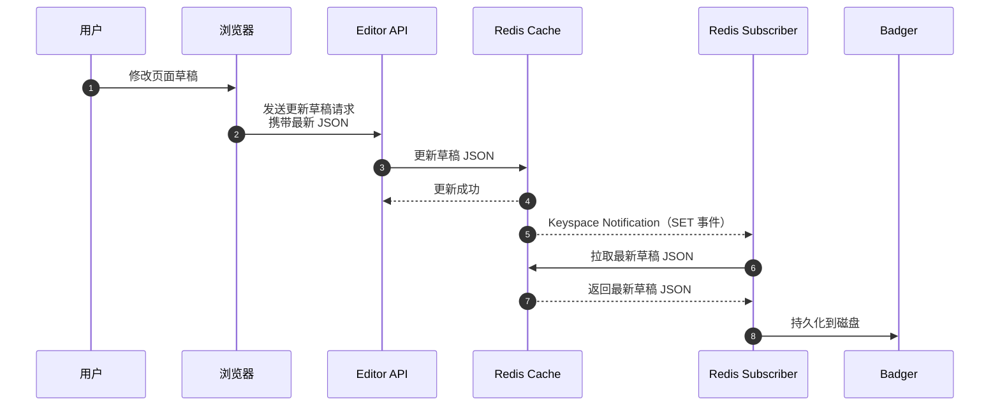
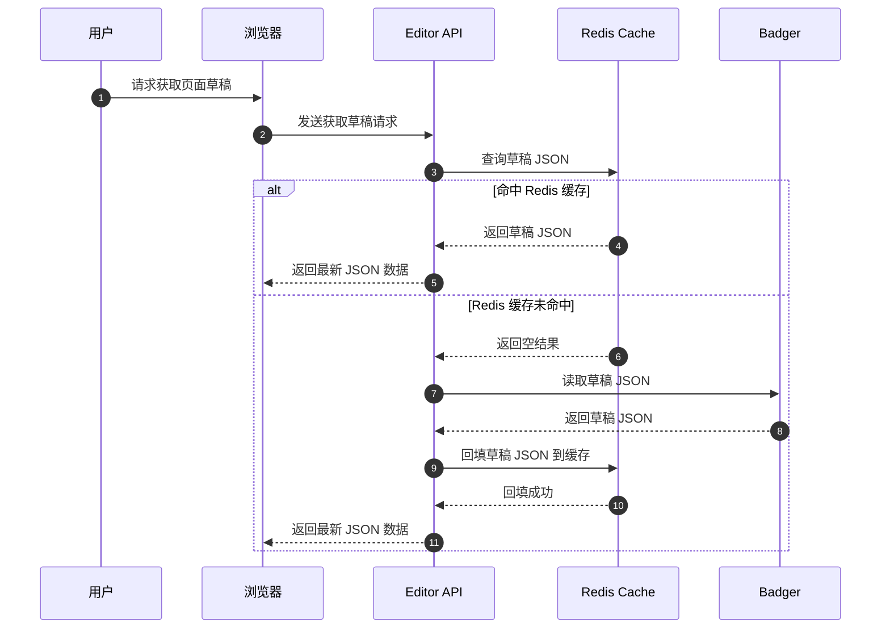
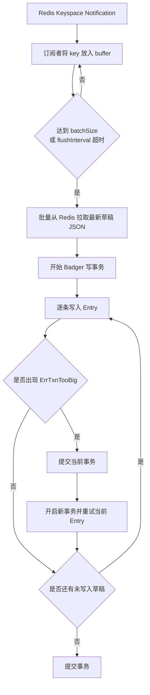
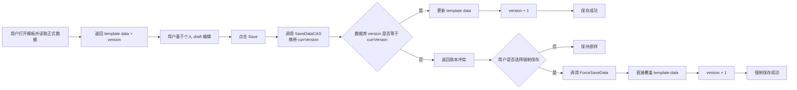
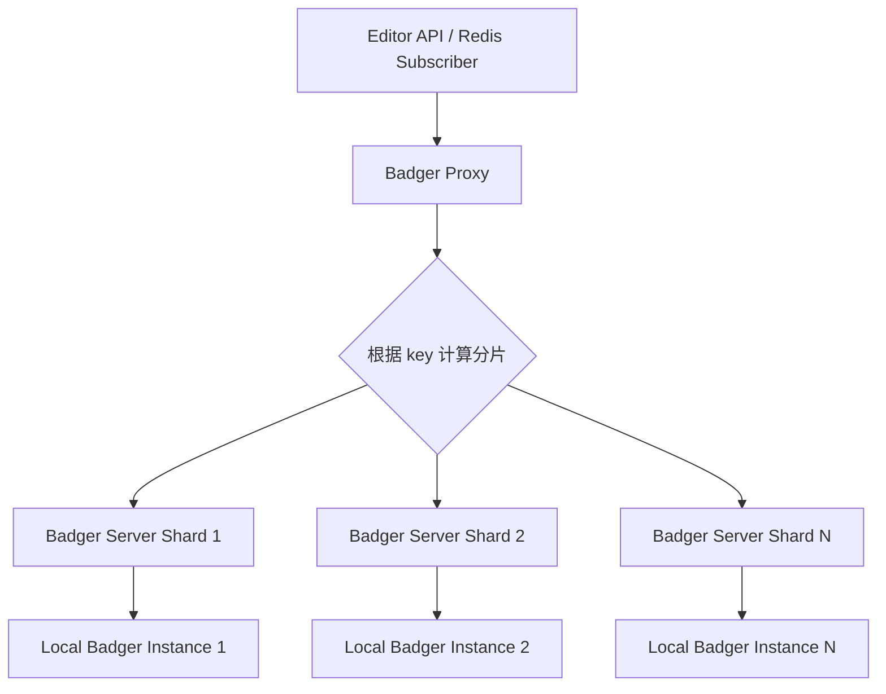
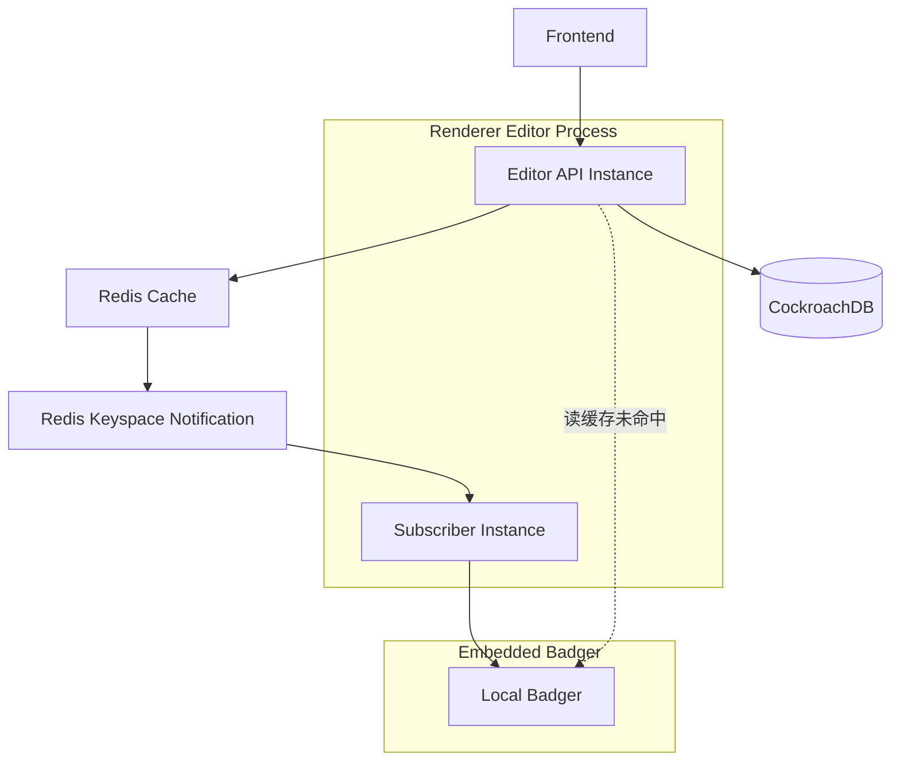
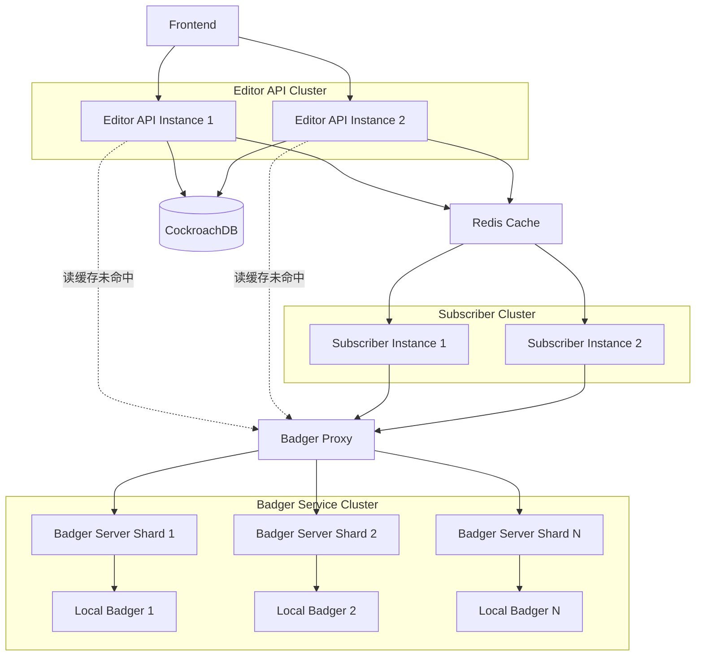

# Renderer 页面编辑器

## 1. 业务介绍


上图是 Shopify theme editor 的界面，我们实现的 template editor 拥有类似的 UI 和功能。
UI 的左侧可以通过添加组件、修改组件预设属性的数据来实现编辑页面，UI 中间是草稿的预览窗口，每当草稿发生改动时，前端会自动发送“更新草稿”和“渲染草稿”的请求，实现草稿的自动更新和预览功能。
UI 的右上角有一个 Save 按钮，只有点击该按钮时，页面草稿才会真正保存到店铺中。

## 2. 页面草稿持久化存储的选择

### 2.1. 页面草稿的数据格式

页面草稿本质上是一个 JSON 格式的数据，其结构例子如下：

```json
{
  "name": "product_page",
  "components": {
    "comp_product_title": {
      "id": "comp_product_title",
      "name": "product_title",
      "element_settings": {
        "padding_top": 36,
        "padding_bottom": 36
      },
      "block_order": ["blc_title", "blc_sub_title"],
      "blocks": {
        "blc_title": {
          "id": "blc_title",
          "type": "title",
          "element_settings": {
            "title_text": "{{ t:template.product_page.comp_product_title.blocks.blc_title.elements.title_text }}",
            "title_size": "h1"
          }
        },
        "blc_sub_title": {
          "id": "blc_sub_title",
          "type": "sub_title",
          "element_settings": {
            "sub_title_text": "{{ t:template.product_page.comp_product_title.blocks.blc_sub_title.elements.sub_title_text }}",
            "sub_title_opacity": 100
          }
        }
      }
    },
    "comp_product_description": {
      "id": "comp_product_description",
      "name": "product_description",
      "element_settings": {
        "padding_top": 50,
        "padding_bottom": 50
      },
      "block_order": ["blc_description", "blc_extra_description"],
      "blocks": {
        "blc_description": {
          "id": "blc_description",
          "type": "description",
          "element_settings": {
            "description_content": "{{ t:template.product_page.comp_product_description.blocks.blc_description.elements.description_content }}",
            "description_size": "h1",
            "description_line_height": 28
          }
        },
        "blc_extra_description": {
          "id": "blc_extra_description",
          "type": "description",
          "element_settings": {
            "description_content": "{{ t:template.product_page.comp_product_description.blocks.blc_extra_description.elements.description_content }}",
            "description_size": "h2",
            "description_line_height": 20
          }
        }
      }
    }
  },
  "order": ["comp_product_title", "comp_product_description"]
}
```

当用户在 editor 编辑页面草稿时，本质上就是在修改上述 JSON 对象，并将更新后的 JSON 数据发送给 API。

### 2.2. 页面草稿的读写频率

当用户在编辑页面草稿时，JSON 数据会被加载到 Redis 中加速访问。我们使用 Redis 提供的键空间通知（KeySpace Notification）功能订阅 JSON 缓存在 Redis 中的 SET 事件实现落盘（我们会在后面详细介绍）。
所以，基本可以认为每当用户对 JSON 数据进行一次编辑，最终都会触发一次缓存落盘，草稿写磁盘的频率是非常高的。



而对于草稿数据的读操作，只有在 Redis 缓存过期时，才会触发一次从磁盘中读取草稿的动作，在缓存过期前，草稿所有读请求都在缓存层完成，草稿读磁盘的频率是非常低的。



我们预估草稿 JSON 数据的读写磁盘比例约为 1：99

### 2.3. 选型

结合上面的业务特点，页面草稿存储方案需要满足以下几点：

- 草稿数据天然是 JSON 结构，最好对动态字段和无模式数据友好。
- 落盘写入频率高，要求写性能稳定，适合写多读少场景。
- 需要支持持久化存储，避免 Redis 过期或实例异常后草稿丢失。
- 页面草稿的业务含义是可过期的，需要结合持久化存储实现过期功能。
- 期望部署和接入成本尽量低。

| 维度             | MongoDB                            | RocksDB                        | Badger                    |
| ---------------- | ---------------------------------- | ------------------------------ | ------------------------- |
| 数据模型         | 文档型，天然适合 JSON              | KV 存储，值可自行存 JSON       | KV 存储，值可自行存 JSON  |
| Schema 灵活性    | 很强，无模式                       | 强，由业务控制 value 结构      | 强，由业务控制 value 结构 |
| 写多读少场景     | 可以支持，但引入独立数据库成本较高 | 写性能强                       | 写性能强，适合本场景      |
| 过期时间支持     | 需要依赖 TTL Index，偏集合级管理   | 无原生 TTL，需业务自行维护     | 原生支持 TTL，接入简单    |
| 部署形态         | 独立数据库服务                     | 本地嵌入式引擎，需额外 Go 封装 | Go 原生嵌入式，集成成本低 |
| 运维复杂度       | 较高，需要独立部署和运维           | 低，随服务进程启动即可         | 低，随服务进程启动即可    |
| 查询能力         | 强，支持复杂条件查询               | 弱，偏底层 KV                  | 弱，偏底层 KV             |
| 与当前场景匹配度 | 中等，能力过剩                     | 较高                           | 最高                      |

下面分别说明三者的取舍。

#### MongoDB

MongoDB 最大的优势是文档模型与 JSON 数据天然契合，页面草稿直接以文档形式存储即可，开发体验很好。如果我们的场景需要复杂查询、聚合分析、多维筛选，那么 MongoDB 会是更自然的选择。

但在当前场景下，草稿数据的访问模式非常简单：

- 写入非常频繁；
- 读取主要按主键回源；
- 完全没有复杂查询需求。

MongoDB 的 B-Tree 存储引擎平衡了读与写的性能消耗，通常更适合读多写少的情况。而且，MongoDB 很多强大的能力在这里并不能被充分利用，反而会带来额外的部署、运维和网络访问成本。对于一个主要承担“Redis 缓存后的持久化兜底”职责的存储层来说，这个方案偏重了。

#### RocksDB

RocksDB 是非常成熟的嵌入式 LSM-Tree 存储引擎，写性能很好，也很适合高频写入场景。如果我们只关注 KV 落盘能力，RocksDB 本身是一个很强的候选。

但 RocksDB 在 Go 里通常需要额外依赖 CGO 或第三方绑定，接入、编译和部署成本相对更高。同时，RocksDB 不直接提供像 `TTL` 这样贴合当前业务的简单能力，草稿过期往往需要业务层额外设计清理逻辑。

也就是说，RocksDB 虽然性能上没有问题，但工程复杂度会更高。

#### Badger

Badger 同样是面向 KV、 LSM-Tree 存储引擎实现的嵌入式存储，而且是纯 Go 实现，与当前项目技术栈非常契合。对于我们的场景，它有几个明显优势：

- 可以直接把页面草稿 JSON 序列化后作为 value 存储；
- 写性能适合高频落盘；
- 读路径简单，按 key 获取即可；
- 原生支持 `TTL`，可以直接给草稿设置过期时间；
- 以库的形式嵌入到服务中，部署简单，没有额外独立数据库依赖。

Badger 也不是完全没有代价，它并不擅长复杂查询，只适合当前这种基于主键读写的场景。

不过这些限制与我们的业务模型是匹配的：页面草稿落盘本质上就是“按草稿 key 覆盖写入”，并不需要复杂查询能力。

#### 结论

综合来看：

- MongoDB 更偏通用文档数据库，适合读多写少的场景，文档编辑能力强，但对本场景来说偏重；
- RocksDB 性能优秀，但 Go 接入和 TTL 管理的工程成本更高；
- Badger 在数据模型、写入模式、TTL 能力、部署复杂度上与当前页面草稿持久化场景最匹配。

因此，这里最终选择 `Badger` 作为页面草稿的持久化存储。

## 3. 落盘策略

### 3.1. 页面草稿持久化

页面草稿的持久化并不是每次编辑都同步写入磁盘，而是采用 `Write Back` 策略：

- 用户编辑页面草稿时，请求首先更新 Redis 中的草稿 JSON；
- Redis 中的数据作为当前最新草稿的实时状态；
- Redis 通过 Keyspace Notification 通知后台订阅者某个草稿发生了变更；
- 订阅者异步将最新草稿批量写入 Badger，完成落盘。

这样设计的核心目标是把“高频编辑请求”与“磁盘 IO”解耦。

如果每次前端修改一个字段都“同步”写磁盘，那么：

- 接口延迟会明显上升；
- 磁盘写压力会直接暴露到在线请求链路中。

而采用 `Write Back` 后，请求链路只需要保证 Redis 更新成功即可快速返回，磁盘持久化则交给异步订阅者完成。这种方式更符合页面草稿“写频率高、允许短暂异步落盘”的业务特点。

同时，订阅者侧还可以进一步做批处理优化：

- 在短时间窗口内聚合同一批草稿 key；
- 批量从 Redis 拉取最新 JSON；
- 批量写入 Badger；
- 当单次事务写入过大时，处理 `badger.ErrTxnTooBig`，拆分成多个事务提交。



也就是说，`Write Back` 不只是“异步写”，还意味着可以在持久化层做合并和削峰，从而减少磁盘写放大。

Write Back 实现的代码例子如下：

```go
// biz/design/renderer/editor/pubsub/subscriber_template_draft.go
package pubsub

func (s *templateDraftSubscriber) Start(ctx context.Context) error {
	// 订阅所有以 template:draft: 开头的键的变更事件（Keyspace Notifications）
	// 使用 PSUBSCRIBE 模式订阅
	pubsub := s.rdb.PSubscribe(ctx, "__keyspace@0__:template:draft:*")
	defer pubsub.Close()

	ch := pubsub.Channel()
	s.client = pubsub

	const (
		batchSize     = 10
		flushInterval = 2 * time.Second
	)

	var (
        // buffer 用作批量写入的缓冲区，同时避免同一个 key 在同 batch 中重复写盘
		buffer = make(map[string]struct{}, batchSize)
        // timer 实现缓冲区超时落盘
		timer  = time.NewTimer(flushInterval)
	)

    // flush 落盘闭包函数
	flush := func() {
		if len(buffer) == 0 {
			return
		}

		keys := make([]string, 0, len(buffer))
		for key := range buffer {
			keys = append(keys, key)
			delete(buffer, key)
		}

        // 从 Redis 批量获取需要落盘的草稿数据
		draftMap, err := s.templateDraftCacheDAO.GetMultiDraftsByKeys(ctx, keys)
		if err != nil {
			log.Err(err).Msg("failed to get multi template drafts by keys during flush")
		}

		if len(draftMap) > 0 {
			drafts := make([]*cache.TemplateDraft, 0, len(draftMap))
			for _, draft := range draftMap {
				drafts = append(drafts, draft)
			}
            // 批量写入 badger
			if err := s.templateDraftDAO.BatchSaveDraft(ctx, drafts); err != nil {
				log.Err(err).Msg("failed to batch save template drafts during flush")
			}
		}

		timer.Reset(flushInterval)
	}

	for {
		select {
		case msg, ok := <-ch:
			if !ok {
				// Channel closed
				flush()
				return nil
			}

			if msg.Payload == "set" {
				key := strings.TrimPrefix(msg.Channel, "__keyspace@0__:")
				buffer[key] = struct{}{}
				if len(buffer) >= batchSize {
					flush() // 这里 flush 会重置 timer
					if !timer.Stop() {
						select {
						case <-timer.C:
						default:
						}
					}
					timer.Reset(flushInterval)
				}
			}

		case <-timer.C:
			flush()

		case <-ctx.Done():
			flush()
			return ctx.Err()
		}
	}
}
```

我们查看 DAO 层批量写入 Badger 的实现：

```go
// biz/design/renderer/editor/dao/db/template/batch_save_draft.go
package template

const draftTTL = 7 * 24 * time.Hour

func (t *template) BatchSaveDraft(ctx context.Context, drafts []*cache.TemplateDraft) error {
	if len(drafts) == 0 {
		return nil
	}

	txn := t.kv.NewTransaction(true)

	for _, draft := range drafts {
		key := templateDraftKey(draft.ID, draft.UserID)
		data, err := json.Marshal(draft)
		if err != nil {
			continue
		}

        // 设置 TTL
	    entry := badger.NewEntry([]byte(key), data).WithTTL(draftTTL)
		if err := txn.SetEntry(entry); err != nil {
            // 处理可能出现的 badger.ErrTxnTooBig
            // reference: https://dgraph-io.github.io/badger/quickstart.html
			if err == badger.ErrTxnTooBig {
				if commitErr := txn.Commit(); commitErr != nil {
					txn.Discard()
					return commitErr
				}

				txn = t.kv.NewTransaction(true)
				if retryErr := txn.SetEntry(entry); retryErr != nil {
					txn.Discard()
					return retryErr
				}
				continue
			}

			txn.Discard()
			return err
		}
	}

	if err := txn.Commit(); err != nil {
		txn.Discard()
		return err
	}

	return nil
}
```

### 3.2. 保存页面草稿，防止并发覆盖

并发编辑无模式数据是一个经典的并发覆盖场景。在当前业务场景下，template（模板）拥有`draft`和`saved`两种状态：

- **草稿层（draft）**：用户在编辑过程中的草稿，保存在 Redis 和 Badger 中；
- **正式数据层（saved）**：用户点击 Save 后真正写入数据库的 `template` 数据。

#### 草稿层：按 `userID` 隔离，不直接共享，没有并发问题

当前草稿落盘到 Badger 时，使用的 key 由 `templateID` 和 `userID` 共同决定：

```go
key := templateDraftKey(draft.ID, draft.UserID)
```

这意味着：

- 同一个 `template`，不同用户会有各自独立的草稿副本；
- 用户 A 编辑的是 `template:draft:{templateID}:{userA}`；
- 用户 B 编辑的是 `template:draft:{templateID}:{userB}`；
- 两个人的草稿不会在 Redis / Badger 层直接互相覆盖。

所以，在“草稿缓存 + 草稿落盘”这一层，核心问题不是多个用户互相写坏同一份草稿，而是如何把**每个用户自己的临时编辑状态**稳定持久化下来。

#### 正式数据层：共享 `template`，需要乐观锁

真正需要处理并发覆盖的，是用户点击 Save 后，把草稿保存为共享 `template` 正式数据的过程。

例如：

1. 用户 A 打开页面草稿并开始编辑；
2. 用户 B 也打开同一份草稿并开始编辑；
3. A 和 B 分别基于各自草稿点击 Save；
4. 两个人最终都要写回同一条数据库中的 `template` 记录；
5. 后提交的一方可能覆盖先提交的一方正式保存结果。

如果不做控制，就会出现“后写覆盖前写”的问题，导致部分编辑结果丢失。

这里适合采用**乐观锁**来解决，而当前代码也正是这样做的。

具体思路是：

- 数据库中的 `template` 记录维护 `version` 字段；
- 用户读取正式数据时，会拿到当前 `version`；
- 用户点击 Save 时，提交自己编辑所基于的 `currVersion`；
- 服务端执行 CAS 更新：只有当数据库中的版本号仍然等于 `currVersion` 时，才允许写入新数据；
- 一旦写入成功，`version` 自动加一；
- 如果更新影响行数为 `0`，说明版本已变化，也就是有其他人先一步保存成功，此时返回冲突结果。

对应的代码类似这样：

```go
// biz/design/renderer/editor/dao/db/template/save_data_cas.go
func (t *template) SaveDataCAS(ctx context.Context, id string, data json.RawMessage, currVersion int) (int64, error) {
	db := t.db.WithContext(ctx)

	updatedTemplate := object.Template{
		Data:    datatypes.JSON(data),
		Version: currVersion + 1,
	}

	result := db.Model(&object.Template{}).
		Where("id = ? AND version = ?", id, currVersion).
		Updates(updatedTemplate)
	return result.RowsAffected, result.Error
}
```

这里 `Where("id = ? AND version = ?", id, currVersion)` 就是乐观锁的关键。它保证只有“我读取时看到的版本仍然是最新版本”时，本次保存才会成功。

另外，代码中还提供了强制保存能力，当用户点击 Save 按钮得到版本号不一致的提示时，前端通过弹窗提供强制保存功能，请求强制保存时数据库不再校验旧的`version`字段，直接更新模板数据并递增版本号，代码如下：

```go
// biz/design/renderer/editor/dao/db/template/force_save_data.go
func (t *template) ForceSaveData(ctx context.Context, id string, data json.RawMessage) (int64, error) {
	db := t.db.WithContext(ctx)

	updates := map[string]any{
		"data":    datatypes.JSON(data),
		"version": gorm.Expr("version + 1"),
	}

	result := db.Model(&object.Template{}).
		Where("id = ?", id).
		Updates(updates)
	return result.RowsAffected, result.Error
}
```



这样可以保证：

- 在线编辑请求尽量快；
- 草稿编辑互不干扰；
- 正式保存时能够识别版本冲突；
- 数据库中共享的 `template` 不会被静默覆盖。

因此，缓存落盘策略解决的是“用户草稿如何高频、低延迟地持久化”的问题，而乐观锁解决的是“多个用户最终保存同一个共享 template 时如何避免覆盖”的问题，两者分别作用在不同层次，但需要配合使用。

## 4. 扩展与演进

当前方案里，Badger 以嵌入式数据库的形式运行在服务进程内部。这种方式在单机或少量实例场景下非常合适：

- 接入简单；
- 本地读写延迟低；
- 不需要额外维护独立存储集群。

但当我们需要将 **Editor API** 和 **Redis Subscriber** 拆分，分别做多实例部署时，嵌入式 Badger 方案会逐渐暴露限制：

- 每个服务实例都只能访问自己本地的 Badger 数据；
- 草稿数据会天然分散在不同机器的本地磁盘上；
- 一旦某个实例下线，本地 Badger 数据无法被其他实例直接接管；
- Redis Subscriber 多副本运行时，也很难直接共享同一套本地 Badger 存储。

因此，当系统规模继续扩大时，可以把 Badger 从“进程内嵌入式存储”演进为“通过网络访问的存储服务”，也就是采用 **C/S（Client / Server）架构** 对 Badger 做一层封装。

### 4.1. C/S 架构封装 Badger

在这个方案中，可以把原先直接嵌入业务进程的 Badger 拆成两类角色：

- **Client**：运行在 Editor API 服务、Redis Subscriber 服务中，负责发起读写请求；
- **Badger Server**：对外提供统一的 KV 访问接口，内部持有真正的 Badger 实例。

这样一来，业务服务本身不再直接操作本地 Badger 文件，而是通过 RPC / HTTP 等方式访问 Badger Server。

它带来的好处是：

- 存储职责和业务职责分离；
- Editor API 与 Subscriber 可以水平扩容，而不必关心本地磁盘状态；
- Badger 节点可以独立部署、迁移和扩缩容；
- 后续做监控、限流、备份、迁移都会更清晰。

### 4.2. 通过 Proxy 按 Key 分片

如果只有一个 Badger Server，虽然解除了“本地磁盘绑定”的问题，但新的瓶颈会集中到单节点上。进一步的演进方式是引入 **Proxy + 分片路由**。

基本思路是：

1. 在 Badger Server 前增加一层 Proxy；
2. Client 不直接感知具体某个 Badger 节点，而是统一请求 Proxy；
3. Proxy 根据 key 计算分片结果；
4. 将请求路由到对应的 Badger Server 节点；
5. 每个节点只负责自己那部分 key 范围的数据。

对于当前场景，分片 key 可以直接使用草稿存储 key，例如：

- `template:draft:{templateID}:{userID}`

也可以基于 `templateID`、`shopID` 或完整草稿 key 做哈希路由。这样能够保证同一份草稿始终落到同一个 Badger 分片节点上。



这种模式下：

- 业务服务只需要知道 Proxy 地址；
- Proxy 负责路由、分片、节点发现；
- 每个 Badger Server 管理自己的本地 Badger 数据；
- 整体容量和吞吐可以通过增加分片节点横向扩展。

### 4.3. 分片策略的考虑

分片时需要重点考虑以下问题：

- **路由稳定性**：新增或下线节点时，尽量减少 key 大规模迁移；
- **热点问题**：如果某些模板或店铺流量非常高，需要避免单个分片过热；
- **迁移成本**：节点扩容时，需要支持旧数据平滑迁移；
- **容灾能力**：单个 Badger Server 异常时，需要有恢复和补偿手段。

因此，实际实现时通常不会使用最简单的取模分片，而更适合使用**一致性哈希**或类似机制，尽量减少扩缩容带来的重分布影响。

### 4.4. 与当前架构的关系

为了更直观地理解当前方案与未来扩展方案的差异，可以先看下面两张架构对照图。

#### 当前架构：本地嵌入式 Badger



这个阶段的特点是：

- Editor API 与 Subscriber 运行在同一个 Renderer Editor 进程实例中；
- Badger 也以内嵌方式运行在该进程实例内；
- 本地读写路径短，实现简单；
- 但数据与实例本地磁盘强绑定，不利于多实例共享和弹性扩容。

#### 扩展架构：C/S + Proxy + 分片 Badger



这个阶段的特点是：

- Editor API 与 Subscriber 从单进程内组件演进为彼此独立的无状态多实例；
- Badger 从进程内嵌式存储演进为独立的网络存储服务；
- Proxy 根据 key 做统一路由，把请求分发到不同 Badger 分片；
- 整体存储容量和吞吐可以通过增加 Badger 节点横向扩展。

当前文档中的方案可以理解为演进的第一阶段：

- Redis 负责高频缓存读写；
- Editor API 与 Subscriber 运行在同一个 Renderer Editor 进程实例中；
- Subscriber 负责异步落盘；
- Badger 作为进程内嵌式持久化存储。

而未来扩展后的方案则是第二阶段：

- Redis 仍然作为高频缓存层；
- Editor API 与 Subscriber 拆分为可独立扩容的无状态服务集群；
- Badger 被封装为独立存储服务集群；
- 通过 Proxy 按 key 分片路由到不同 Badger 节点。

这样既保留了当前“写多读少、KV 持久化、TTL 友好”的优势，也解决了多实例部署下本地嵌入式存储难以共享和扩容的问题。
