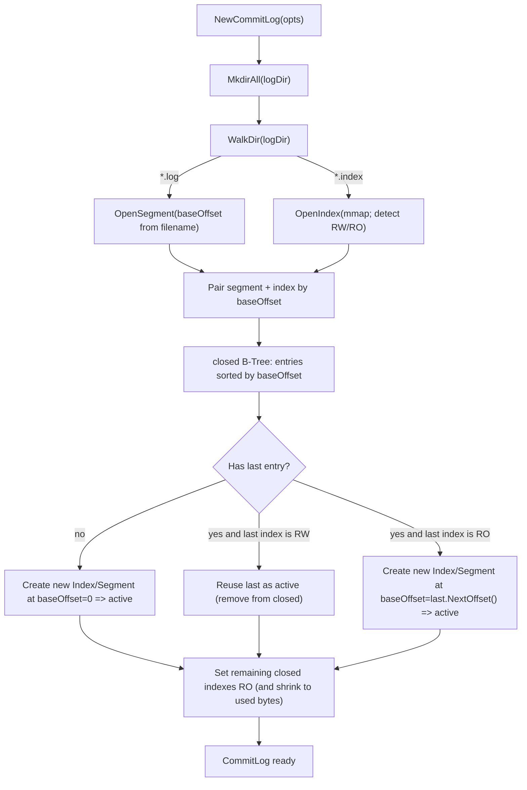
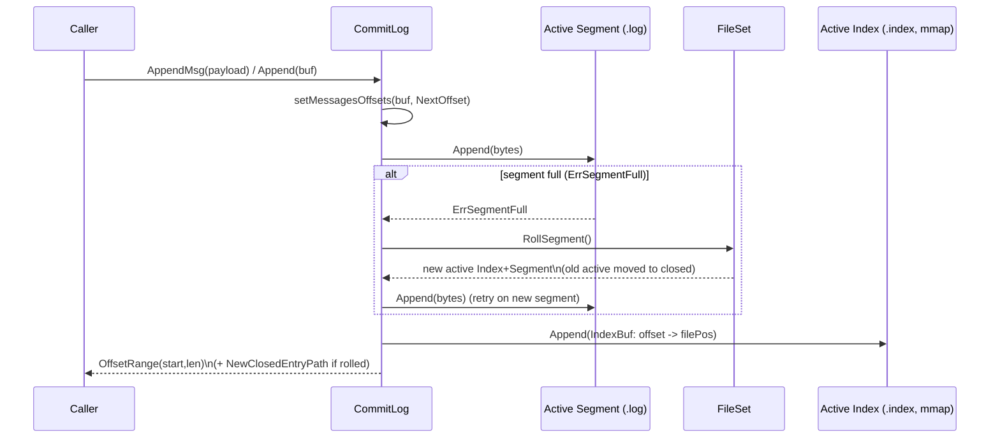
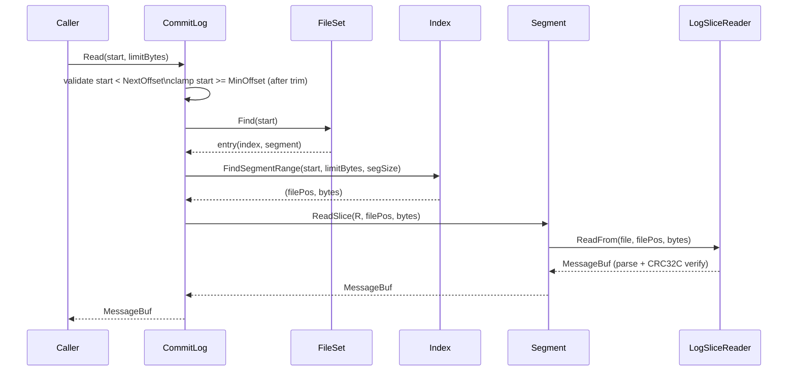
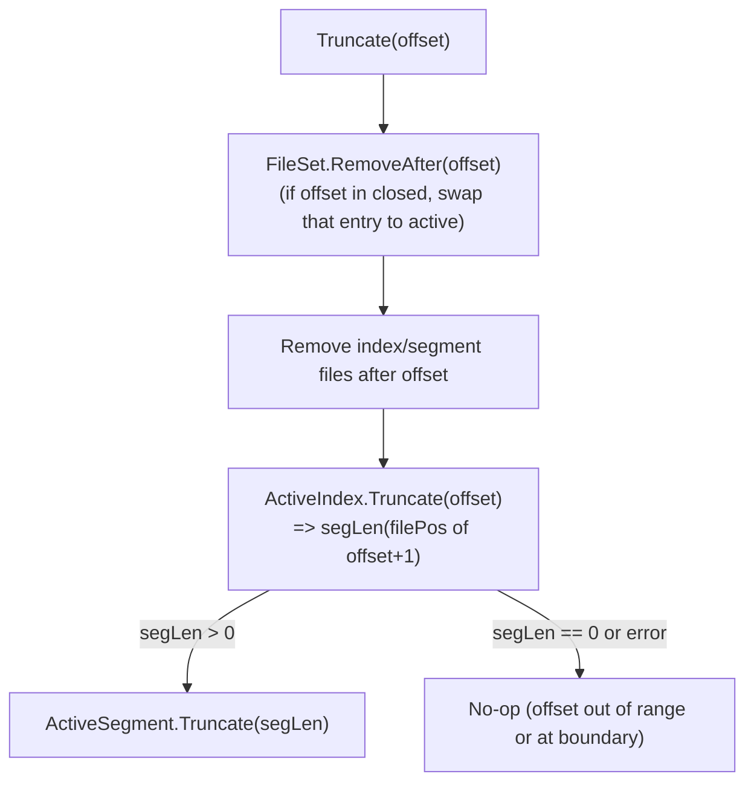
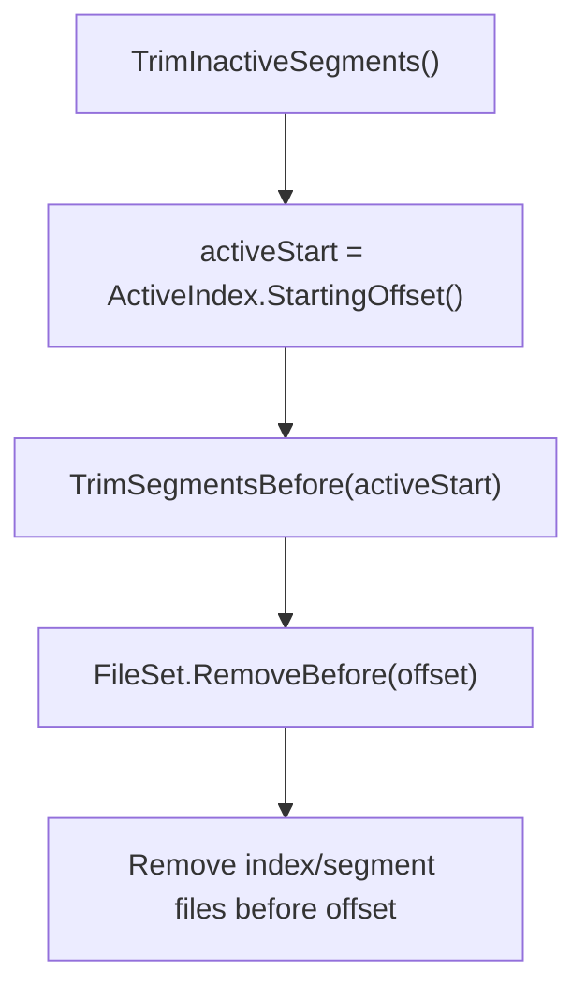

# Commitlog

`commitlog` 是一个基于磁盘的追加日志（append-only log）实现：每条消息都有单调递增的 `Offset`；数据顺序追加到 `.log` 段文件（segment），并在 `.index` 索引文件里记录 `offset -> 文件位置` 以支持按 offset 快速读取。该实现移植自 Rust 开源项目 `zowens/commitlog`，并在测试中验证可以读取 Rust 产出的 log 数据（见 `test-data/.log_rust`）。

## 磁盘布局

一个日志目录（`LogOptions.logDir`）里包含若干对文件：

- `<baseOffset>.log`：segment 文件（顺序追加写）。
- `<baseOffset>.index`：index 文件（mmap，随机读写）。

其中 `baseOffset` 为 20 位 0 填充十进制数字，例如：

```
00000000000000000000.log
00000000000000000000.index
00000000000000000036.log
00000000000000000036.index
```

同一对 `.log/.index` 的 `baseOffset` 相同，表示该 segment 覆盖的 offset 区间从 `baseOffset` 开始。

## 消息格式（Message）

每条消息是“header + metadata + payload”的二进制编码（小端序），其中 header 固定 20 字节：

| 字节范围     | 类型  | 含义                                          |
| ------------ | ----- | --------------------------------------------- |
| 0..7         | u64   | Offset                                        |
| 8..11        | u32   | `metadata+payload` 总长度（不含 header）      |
| 12..15       | u32   | CRC32C（Castagnoli），校验 `metadata+payload` |
| 16..17       | -     | 预留                                          |
| 18..19       | u16   | metadata 长度                                 |
| 20..(20+m-1) | bytes | metadata                                      |
| (20+m)..     | bytes | payload                                       |

segment 文件头部会写入 2 字节 magic（`0xff 0xff`），因此第一条消息通常从文件位置 2 开始。

## 核心组件

- `CommitLog`：对外 API（`Append`/`Read`/`Truncate`/`Trim`/`Flush`）。
- `FileSet`：管理“当前可写 active 段”和“已关闭 closed 段集合”。
  - `active`：当前读写的 `(Index, Segment)` 对。
  - `closed`：按 `baseOffset` 排序的 B-Tree（`btree.BTreeG`），用于快速定位某个 offset 属于哪个 segment。
- `Segment`（`.log`）：只做顺序追加写/按位置读切片/flush/truncate。
- `Index`（`.index`）：mmap 文件；每条 index entry 8 字节：`relOffset(u32)` + `filePos(u32)`。
  - `relOffset = absOffset - baseOffset`。
  - `filePos` 是该消息在 `.log` 中的起始字节位置（注意为 `u32`）。

## 关键流程（Mermaid）

### 1) 初始化与 Reopen（`NewCommitLog`）



说明：

- 目录扫描会忽略未知扩展名文件。
- `OpenIndex` 会根据 index 是否“完整填满”推断其访问模式：
  - 末尾 entry 非空：认为 index 已写满，打开为 `read-only`。
  - 末尾 entry 为空：认为是部分写入，定位断点后打开为 `read-write`。

### 2) 追加写入与滚动（`Append` / `AppendMsg`）



要点：

- `messageMaxBytes` 限制单次 `Append` 的总字节数（`buf.Bytes()`）。
- segment 满了会 roll：旧的 active 变为 closed，新建的 `(Index, Segment)` 从 `NextOffset()` 开始命名文件。

### 3) 按 Offset 读取（`Read(start, limitBytes)`）

`ReadLimit` 是“最多读取的字节数”，不是“最多消息条数”。读取会返回一段“完整消息集合”的连续切片，大小不超过 `limitBytes`。



### 4) 截断（`Truncate(offset)`）

截断语义：保留 `<= offset` 的消息，删除 `>= offset+1` 的消息。



### 5) 清理（`TrimSegmentsBefore` / `TrimInactiveSegments`）



## 使用示例（最小）

参考测试用例 `log_test.go`，例如：

- `AppendMsg`：返回写入消息的 offset。
- `Read(start, limit)`：按 offset 读取一段消息。
- `Flush`：将当前 active 的 segment 和 index 刷盘（`fsync/msync`）。

## 注意事项

- 并发：当前实现未做并发控制；多 goroutine 并发读写需要调用方自行加锁或串行化。
- segment 大小：index entry 的 `filePos` 是 `u32`，因此单个 segment 的可寻址位置理论上受 4GiB 限制；建议将 `logMaxBytes` 配置在 4GiB 以内。
- durability：`Flush()` 才会显式调用 `Sync/Flush`，是否每次 append 都立即落盘取决于 OS 缓存策略。
